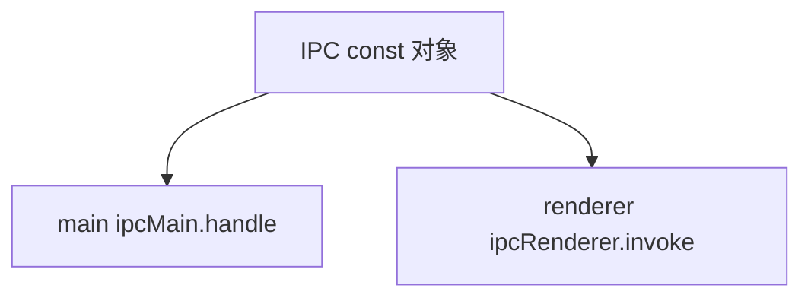

---
paths:
  - "claude-driver/src/shared/events/**/*"
---

<!-- parent: shared -->

### 模块架构图

### 模块概览

- **职责**：IPC 通道名单一真相源（~90 通道）。防字符串硬编码漂移。
- **输入**：无。
- **输出**：IPC const 对象 + IpcChannel 联合类型。

### API 概览

- **`ipc-channels.ts`**
  - `IPC` as const 对象（~90 常量）
  - `IpcChannel` 联合类型 `(typeof IPC)[keyof typeof IPC]`
- **通道分组**（实际从 ipc-channels.ts 提取，~90）：
  - **Main->Renderer 推送**（~20）：HOOK_EVENT、STATUS_LINE、PLAN_UPDATED、SESSION_STATUS、NOTIFICATION、PROJECT_UPDATED、JSONL_RECORD/RECORDS/SUBAGENT_RECORD/BRANCH_SNAPSHOT/SUBAGENT_INSERTIONS、SESSION_BRANCH_LINK、PTY_BIND/UNBIND、NOTIFICATION_FOCUS_TAB、INSIGHT_REPORT_READY、CHAT_MESSAGE、CC_CONNECT_LOG、UPDATER_STATE_CHANGED
  - **Renderer->Main invoke**（~70）：PROJECT_*、SESSION_*、GIT_*、CONFIG_*/DRIVER_CONFIG_*/PROVIDER_*/CLAUDE_SETTINGS_*/PROJECT_SETTINGS_*、MCP_*/SKILL_*、SCHEDULER_*、CC_CONNECT_*、INSIGHT_*/CHAT_*、TERM_WINDOW_*、UPDATER_*、RECOMMEND_GET、API_TEST*、DIALOG_*、SHELL_*、OPEN_WEBVIEW、TOKEN_SCAN_FILE、PERMISSION_RESPOND、PLAN_READ、INSERTION_*、MILESTONE_*、SESSION_META_WRITE
  - **Terminal window**（2）：TERM_DATA（Main->Terminal push）、TERM_RESIZE（Terminal->Main invoke）

### 数据模型

- **`IpcChannel`**：联合类型（所有通道名）。

### 关键流程

- 所有跨进程通信经此常量；类型安全防漂移。

### 状态机

无。

### 异常处理

无。

### 监控与测试

- **测试缺口 [待补]**：无单测（纯数据）。

> 详情请阅读对应 Architecture 块文件：`docs/architecture.md` § shared § events（`.claude/rules/architecture/src/shared/events.md`）
