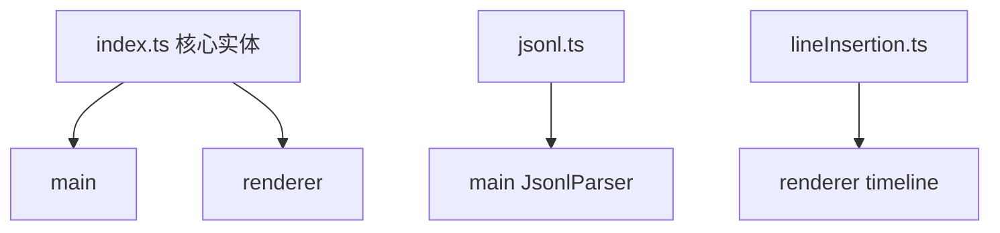

---
paths:
  - "claude-driver/src/shared/types/**/*"
---

<!-- parent: shared -->

### 模块架构图

### 模块概览

- **职责**：核心领域实体类型（跨 main/renderer）。纯 TypeScript interface/type，jsonl.ts 含一个纯函数 extractToolDisplay。
- **输入**：无。
- **输出**：类型 + 纯函数。

### API 概览

- **`types/index.ts`**（核心实体）：
  - `ClaimStatus = 1 | 0 | -1`、`PermissionMode`（6 模式）
  - `Project`：id/name/path/claimStatus/isGitRepo/activeSessionId/sessionIds[]/lastActiveAt/feishuBot?
  - `SessionStatus = 'Running' | 'Paused' | 'Interrupted' | 'Completed'`
  - `TokenUsage`：current/max/usedPercentage（all `number | null`）
  - `Session`：id/claudeId?/projectId/status/currentModel/tokenUsage/transcriptPath/cwd/startedAt/endedAt/worktreePath
  - `PlanStatus = 'TODO' | 'DOING' | 'DONE'`、`PlanLevel = 'M' | 'S' | 'T'`
  - `PlanNode`：id/projectId/level/title/status/parentId/filePath/updatedAt
  - `AgentType = 'General' | 'Explore' | 'Plan'`
  - `AgentNode`：id/sessionId/type/parentId/transcriptPath/status/startedAt/endedAt
  - `TokenStats`：monthlyTokens/totalCostUsd/mostUsedModel/costByProject
  - `HookEventName`（12 变体）：SessionStart/PreToolUse/PostToolUse/PostToolUseFailure/SubagentStart/SubagentStop/Notification/Stop/SessionEnd/PreCompact/PostCompact/PermissionRequest/PermissionDenied
  - `HookPayload`（判别联合）：HookPayloadBase/ToolUse/Subagent/Notification 扩展
  - `HookEvent`：eventName/sessionId/cwd/transcriptPath/payload/receivedAt/userHooks?
  - `StatusLineData`：model/context_window{current_usage,max_tokens,used_percentage}/rate_limits/transcript_path/cwd
  - `NotificationType`、`Notification`
  - `SessionHistoryMeta`、`GitMark`、`PlanIndicatorStatus/PlanIndicator`、`Milestone`
  - `DriverConfig`：tokenPriceInputPerM/tokenPriceOutputPerM/monthlyBudgetAlertUsd/desktopNotificationsEnabled/themePreference/uiLanguage?
  - `ProviderId/ProviderPreset/ProviderEnvBlock`
  - `FeishuBotConfig`
- **`types/jsonl.ts`**：
  - `JsonlMessageType = 'user' | 'assistant' | 'tool_use' | 'tool_result' | 'system' | 'summary'`
  - `JsonlToolUse`：id/name/input
  - `JsonlToolResult`：tool_use_id/content/is_error?
  - `JsonlUsage`：inputTokens/outputTokens/cacheCreationTokens/cacheReadTokens
  - `JsonlRecord`：uuid?/type/text?/toolUse?/toolResult?/cwd?/sessionId?/isSidechain?/agentId?/isBranchStart?/usage?/model?/raw?/parsedAt
  - `ToolDisplayInfo`：toolName/displayText
  - `extractToolDisplay(toolUse: JsonlToolUse): ToolDisplayInfo` — 纯函数：Bash->desc/cmd, Read/Write/Edit/MultiEdit/Glob->file_path/path, WebFetch->url, Agent->desc, Grep->"pattern in path", default->desc||name
- **`types/lineInsertion.ts`**：
  - `LineInsertionType`（10 类）：'tool' | 'mcp' | 'cli' | 'skill' | 'workflow' | 'insight' | 'subagent' | 'branch' | 'btw' | 'user-input'
  - `LineInsertionDirection = 'left' | 'right'`（right=tool-class, left=experience/interaction-class）
  - `LineInsertionLength = 'short' | 'medium' | 'long'`
  - `LineInsertionStatus = 'pending' | 'running' | 'done' | 'failed'`
  - `LineInsertion`：id/type/direction/color/length/customWidth?/sessionId/timestamp/badgeContent/status/isAnimating/lineLabel?/agentId?/toolUseId?/triggerYOffset?

### 数据模型

见 API 概览（全为类型定义）。

### 关键流程

- 跨进程契约；IPC payload 类型；atom 状态类型；JSONL 解析类型。

### 状态机

- **SessionStatus**：Running/Paused/Interrupted/Completed（main pty + renderer session-core.atom）。
- **HookEventName 12 变体**：分发到对应 business handler。

### 异常处理

- HookPayload 判别联合支持类型安全分发。
- jsonl.ts 的 extractToolDisplay 与 main JsonlParser 重复实现（保持同步）。

### 监控与测试

- **测试缺口 [待补]**：无单测（纯类型）。

> 详情请阅读对应 Architecture 块文件：`docs/architecture.md` § shared § types（`.claude/rules/architecture/src/shared/types.md`）
