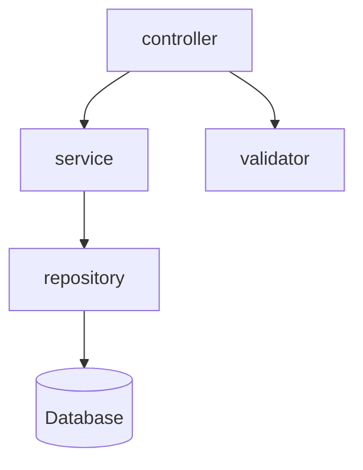

# TDD 模板 (Technical Design Document)

## 核心定位

TDD 回答「**每个模块如何实现？（Implementation）**」，聚焦**技术实现**，不讨论产品价值。

在 block_sync 递归文档体系中，每级块文件的 `###` 标题会被 selective hideRule 处理：
- **导航类维度**（模块概览、API 概览）→ 标题 + 正文**保留**，随 sync 级联传递
- **细节类维度**（数据模型、关键流程、状态机、异常处理、监控与测试）→ 只留标题行在汇总中，细节需读原文

---

## 章节结构（每模块一个 `##` 块，以下为各技术维度 `###`）

### 模块架构图（导航类 · 内容保留，会级联传递）

- 用 **mermaid** 描述该模块内部的组件/文件之间的依赖关系
- 图中节点 = 该模块内部的子组件/文件，边 = 依赖/调用关系

示例：

### 模块概览（导航类 · 内容保留，会级联传递）

- **职责**：这个模块的职责是什么
- **输入**：模块接收什么数据/信号（从哪些来源，什么格式）
- **输出**：模块产出什么数据/信号（输出到哪里，什么格式）

### API 概览（导航类 · 内容保留，会级联传递）

列出关键接口签名摘要，不写全量参数细节。

- **接口名**：完整的函数签名/方法签名/API endpoint
- **参数概要**：参数类型和含义（写重点，不写是否必填、默认值等细节）
- **返回值**：返回值的类型和含义
- **错误码**：可能返回的错误类型

> 接口的完整签名、参数细节、调用示例等细节读原块文件。这里只写概要。

### 数据模型（细节类 · 只留标题）

列出涉及的表和结构，细节读原文。

#### Table（有哪些表/数据结构）

| 表/结构名 | 说明 | 存储引擎/类型 |
|-----------|------|--------------|
| [名称] | [说明] | [如 MySQL, SQLite, 内存, 文件等] |

#### Field（每个字段是什么）

对每个表/结构：

**表: [表名]**
| 字段名 | 类型 | 必填 | 默认值 | 说明 | 约束 |
|--------|------|------|--------|------|------|

#### Index（哪些字段需要索引）

| 索引名 | 字段 | 类型(唯一/普通/全文等) | 说明 |
|--------|------|----------------------|------|

#### Migration（数据库如何升级）

**Migration: [版本号]**
- **变更类型**：新增表 / 修改字段 / 新增索引 / 数据迁移
- **变更内容**：[具体变更描述]
- **回滚方案**：[如何回滚此变更]
- **影响范围**：[影响哪些模块和功能]

### 关键流程（细节类 · 只留标题）

用文字或时序图描述关键操作的执行时序。每个操作的详细时序写单独的 `xxxSOP.md`，本文只列概要。

- **正常流程**：一次完整调用的步骤顺序
- **异常流程**：出错时的回退/补偿步骤
- **并发考虑**：多线程/多请求同时执行时的行为

### 状态机（细节类 · 只留标题）

对有状态的实体定义。有则写，无则省略。

- **状态列表**：该实体可能处于的所有状态
- **状态转换条件**：从状态 A 到状态 B 需要满足什么条件
- **状态转换副作用**：状态切换时触发什么操作

示例格式：

**状态机: [实体名称]**

**状态**：
- `状态1` — [说明]
- `状态2` — [说明]

**转换规则**：
| 从 | 到 | 触发条件 | 副作用 |
|----|-----|---------|--------|
| 状态1 | 状态2 | [条件] | [副作用] |

### 异常处理（细节类 · 只留标题）

- **可恢复异常**：什么异常可以自动恢复，恢复策略是什么
- **不可恢复异常**：什么异常需要人工介入，如何通知
- **降级策略**：关键路径上某个模块不可用时的降级行为
- **重试策略**：什么情况需要重试，重试次数、间隔、退避算法

### 监控与测试（细节类 · 只留标题）

**关键日志点**：

| 日志点 | 级别 | 记录内容 | 用途 |
|--------|------|---------|------|
| [位置/事件] | DEBUG/INFO/WARN/ERROR | [记录什么信息] | [排查什么问题] |

**Trace 方案**：
- **Trace ID 传递**：[如何生成、如何在模块间传递 trace id]
- **关键指标**：[需要监控的关键指标及告警阈值]

**测试清单**：

| 测试点 | 测试类型（单元/集成/E2E） | 测试场景 | 预期结果 |
|--------|--------------------------|---------|----------|
| [测试点1] | [类型] | [场景描述] | [预期结果] |

**关键验证节点**：
- [列出最关键的、必须通过测试验证的功能节点]

---

## 约束

- **不讨论产品价值**：不解释「为什么用户需要这个功能」（已在 MRD/PRD 中讨论）
- 聚焦具体的技术实现细节
- 所有 API、数据模型、状态机必须与 Architecture 中定义的模块边界一致
- 不确定的技术细节标注 `[待确认]`
- **只描述下一级**，不越级
