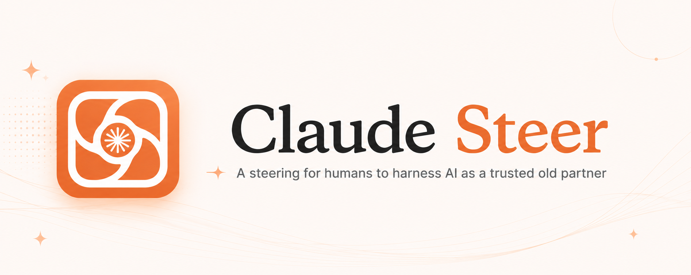

<p align="center">
  
</p>

<p align="center">
  <strong>A steer for humans to harness AI like a trusted old partner</strong>
</p>

<p align="center">
  <a href="https://github.com/Ebwai/Claude-Steer/blob/main/LICENSE"></a>
  <a href="https://github.com/Ebwai/Claude-Steer/releases"></a>
  <a href="https://github.com/Ebwai/Claude-Steer/releases"></a>
  <a href="https://github.com/Ebwai/Claude-Steer"></a>
  <br/>
  
  
  
  
</p>

<p align="center">
  <a href="README_CN.md">中文</a> | <strong>English</strong>
</p>

---

## What is Claude Steer?

Claude Steer is a cross-platform desktop Harness tool for AI. It is:

- **A tool** -- like a steering wheel that lets humans harness AI as a trusted partner. We see what AI is thinking, AI sees what we're doing and offers suggestions, with an efficient mechanism for bidirectional human-AI (and multi-AI) interaction. Available on Windows, Linux (Ubuntu), and macOS
- **A stage** -- the v1 framework is built, but the show hasn't started yet. Future releases will bring richer capabilities and content built on top of this platform (currently no Harness beyond Claude Code is integrated). The roadmap is focused on delivering quality "performances" while continuously improving the stage itself

> **Note**: The current v1 is a platform prototype. Future major releases will progressively implement the full vision of human-AI collaboration.
>
> This project is developed on Ubuntu and uses Electron with platform-specific adaptations for multi-platform builds. Ubuntu provides the most stable experience. The macOS version currently only supports source-code builds due to code signing requirements and the author not having a macOS machine -- official macOS support is planned.

> **Why Claude Steer?** When AI Harness is still in its exploratory phase with no established paradigm, I believe you should first find a good tool. Like having 15 boxes to move -- when you don't know the most efficient method, find the right tool first rather than carrying them one by one.

>  Intro video: pain points/needs --> detailed introduction of new concepts and mechanisms:
>  Live demo 1:

---

## Who is this for?

If you use Claude Code (or plan to) and identify with any of the following, Claude Steer is for you:

**Workflow & Visibility**

- Full visualization of Claude Code workflows
- Understand how agents solve problems
- Learn from AI's problem-solving approach (trained on the collective wisdom of humanity)

**Multi-Project & Multi-Agent**

- Multi-project portfolio management
- Single-project deep management
- Multi-agent collaboration
- Multi-session chaos management
- Unified notifications that protect your focus

**Planning, Reliability & Efficiency**

- Three-level plan structure to keep agents on track
- Hallucination detection and verification
- Context hygiene for cleaner interactions
- Version rollback for safety
- One-click Git, one-click remote sync

**Cost & Configuration**

- Token usage and cost tracking across providers
- Seamless multi-provider switching
- Intuitive Claude Code configuration management

**Stay Current**

- The framework is ready -- quickly discover and adopt new agent features and capabilities (whether from Claude Code updates or a Skill you want to try in your project right away)
- Curated high-quality AI development open-source projects (cc-connect, openwolf, Skills, MCP servers, and more) with continuous updates
- One-click software updates, no manual uninstall/reinstall needed

**Review & Reflection**

- When using Claude Code in fragments during work, it's hard to manually organize interactions into systematic summaries. Claude Steer helps you review, learn from experience, and improve efficiency
- Multi-level classification and visualization make it easy to revisit and review historical interactions on your own
- If AI makes a mistake, trace back to exactly where and how it went wrong

**Remote**

- Remote control of Claude Code sessions (powered by [cc-connect](https://github.com/nicepkg/cc-connect))

---

## Prerequisites

Claude Steer checks dependencies on startup and blocks entry if anything is missing.

| Dependency | Minimum Version | Notes |
|:-----------|:----------------|:------|
| **Node.js** | >= 18 (22 LTS recommended) | Runtime for Claude Code CLI; source builds require >= 22.12.0 |
| **npm** | Bundled with Node.js | Package installation |
| **Git** | Any modern version | Version control operations |
| **Claude Code CLI** | Latest version | Core agent process driven via PTY |

<details>
<summary><strong>Platform-specific installation guides</strong></summary>

### Windows

```powershell
# Node.js (includes npm)
winget install OpenJS.NodeJS.LTS

# Git
winget install Git.Git

# Claude Code CLI
npm install -g @anthropic-ai/claude-code
```

### macOS

```bash
# Node.js
brew install node@22

# Git (usually comes with Xcode CLI Tools)
xcode-select --install

# Claude Code CLI
npm install -g @anthropic-ai/claude-code
```

> **Note**: When launching from Dock/Launchpad, Claude Steer automatically reads your `.zshrc` / `.bash_profile` to restore the full PATH. No manual configuration needed.

### Ubuntu / Debian

```bash
# Node.js
curl -fsSL https://deb.nodesource.com/setup_22.x | sudo -E bash -
sudo apt-get install -y nodejs

# Git
sudo apt-get install -y git

# Claude Code CLI
npm install -g @anthropic-ai/claude-code
```

</details>

---

## Quick Start

### Option 1: Pre-built Installer (Recommended)

Download the installer for your platform from [GitHub Releases](https://github.com/Ebwai/Claude-Steer/releases):

| Platform | File |
|:---------|:-----|
| Windows | `claude-steer-x.x.x-setup.exe` |
| Linux | `claude-steer-x.x.x.AppImage` |

```bash
# Linux: make executable and run
chmod +x claude-steer-*.AppImage
./claude-steer-*.AppImage
```

### Option 2: Build from Source

```bash
git clone https://github.com/Ebwai/Claude-Steer.git
cd Claude-Steer/claude-driver
npm install
npm run dev
```

> `npm install` triggers `postinstall` which compiles `node-pty` for your Electron version. Requires Node.js >= 22.12.0.

### What happens on first launch?

1. **Dependency check** -- verifies Node.js, npm, Git, and Claude Code CLI; offers one-click install for missing CLI
2. **Configuration injection** -- writes Hook events and statusLine bridge scripts to `~/.claude/settings.json` (merges, does not overwrite)
3. **Log initialization** -- creates session logs under `~/.claude-steer/logs/`

---

## Architecture

### Tech Stack

| Layer | Technology |
|:------|:-----------|
| Runtime | TypeScript, Node.js |
| Framework | Electron, React, Vite (electron-vite) |
| Visualization | React Flow (@xyflow/react), Xterm.js |
| State Management | Jotai |
| Internationalization | i18next |
| Testing | Vitest, React Testing Library |
| Build | electron-builder |
| CI/CD | GitHub Actions |

### Project Architecture
The architecture of this project has undergone a major refactoring. The author is still exploring several research topics: designing an architecture readable and updatable by Agents, enabling Agents to read and index large-scale projects within a limited context window with fewer tokens, allowing Agents to upgrade large projects in compliance with specified standards, and automatically generating human-readable documentation throughout the whole process. The publicly available version has removed some content related to project construction by Agents. Meanwhile, the author is continuously optimizing the architecture and process paradigm for Agent-assisted development. Once the approach is fully verified and mature, it will be integrated into the public code repository of this project or released in a separate repository.

---

## FAQ
>  The current version of Claude Steer may have some bugs, but the software is designed with a fallback mechanism. In any situation, clicking "Open Terminal" at the bottom of each main panel in the history work panel can resolve most potential bugs, because the terminal opened here has all its views and interactions native to Claude Code -- as long as CC itself doesn't have a bug, you can still get back to work normally. Moreover, the various features in Claude Steer are designed to be as decoupled as possible. As long as the bug isn't in the underlying capabilities, after a bug occurs at one point, most other features can still be used normally. As the initial version is a product developed independently by an individual, and the author was near graduation during development with many things running in parallel, it's inevitable that some non-critical bugs in certain details of Claude Steer remain unfixed for now. Please be understanding -- subsequent version updates will gradually resolve them.

### Claude Steer shows spinning indicator after sending a command with no new output

This is likely triggered by a newer version of Claude Code (>2.1.153) where `AskUserQuestion` is hardcoded into the interaction flow rather than triggered via the tool mechanism. Claude Steer hasn't adapted to this behavior yet.

**Workaround**: Use the built-in terminal (click "Open Terminal" under each agent panel) for full native Claude Code CLI interaction. All unadapted features work normally through this entry point.

### macOS: "command not found" when launching from Dock

GUI apps launched from Dock/Launchpad inherit a minimal `PATH` from launchd. Claude Steer automatically reads your `.zshrc` or `.bash_profile` to restore the full PATH. If commands are still not found, launch from the terminal:

```bash
open /Applications/claude-steer.app
```

### node-pty load failure

If startup reports "node-pty not correctly compiled":

```bash
cd claude-driver
npm run postinstall
npm run dev
```

### Port 39521 already in use

Claude Steer's Hook Server uses port 39521. If occupied, a dialog will appear on startup. You can change the port in global settings -- the app will automatically update the Hook URL and statusLine bridge scripts.

### Windows PowerShell execution policy restriction

Claude Steer registers the statusLine bridge script (`.ps1`) with `-ExecutionPolicy Bypass`. No additional configuration is typically needed.

---

## Afterword

Claude Steer was conceived on April 4, 2026, during the Qingming Festival holiday. The original plan was to ship v1 before Labor Day, but as the project evolved, requirements kept expanding. The author has a bit of a design obsession -- when a high-priority feature comes to mind, not including it in v1 feels like having a thorn that must be pulled out.

What started as a simple visualization tool built from studying the Claude Code documentation gradually evolved. As I used Claude Code's mechanisms and concepts in my own vibe coding, I discovered usage patterns and wanted to place these mechanisms where they belong in context -- both reminding myself to use them and improving interaction efficiency. So I extracted Claude Code's core concepts and turned them into interactive features.

Later, during an internship with intense real-world vibe coding, I developed a deeper understanding of Harness. I extracted the requirements that could most quickly improve vibe coding efficiency and standards, introducing three-level planning, multi-project management, multi-agent management, session management, branch management, and even subagent management. The project shifted from "visualization tool" toward a "tool" positioning.

As someone who follows AI developments, I also collected excellent open-source projects for vibe coding (especially Claude Code) -- cc-connect, openwolf, Skills, MCP servers, and more -- and gradually integrated them into the software.

Requirements kept growing, and I underestimated how much squeezing four parallel tracks (internship, exams, graduation defense, job hunting) would compress my free time. Random uncontrollable events also consumed development time. The code was finally mostly complete by June 1, 2026, followed by multi-platform distribution, testing, compatibility fixes, and promotion work. The first official version was released on July 8, 2026.

Ironically, while this project was meant to be a framework for incorporating my learning and practical insights, the development process itself kept generating new theoretical and practical insights -- making requirements grow partly because of the project's own development. And since I hadn't formed my own paradigm understanding of Harness at the start, the architecture underwent a major refactoring (to support a grander vision and make it more AI-native -- enabling future upgrades within limited context windows using fewer tokens, with non-destructive, convention-following development: an architecture suited for AI's future development, not just human development).

Requirements kept growing, and many ideas remain unimplemented. But I wanted to release a public version as soon as possible to give people a tool they can use while the Harness paradigm is still forming -- a tool to improve efficiency and grow together with AI through continuous bidirectional feedback. So here's this rough-cut version. I hope it truly helps those using agents to boost productivity (whether you chose it or were pushed into it). I'll continue updating and improving, but I'm busy and one person's capacity is limited, and I'm still learning. Please be understanding of any bugs or immature design choices -- and if you can file an issue, even better. If like-minded friends want to contribute, you're welcome to contact me or submit commits. Commit guidelines will be published when I have time.

Finally, if this project has truly helped you, I'd appreciate a **star** or some encouragement. Thank you!

---

## License

This project is licensed under the [GNU General Public License v3.0 (GPLv3)](LICENSE).

For commercial inquiries, custom versions, or collaboration opportunities, contact: tonygithub@163.com

The author also has ideas about Agents on smart glasses that go beyond this project -- believing smart glasses are the best vehicle for bringing Agents into everyone's daily life. If interested, feel free to reach out via email.

---

<p align="center">
  <a href="https://www.buymeacoffee.com/tonyleung" target="_blank">
    
  </a>
</p>
