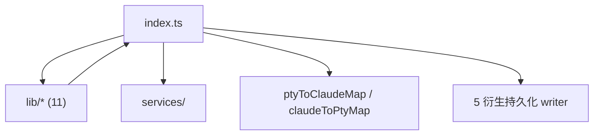
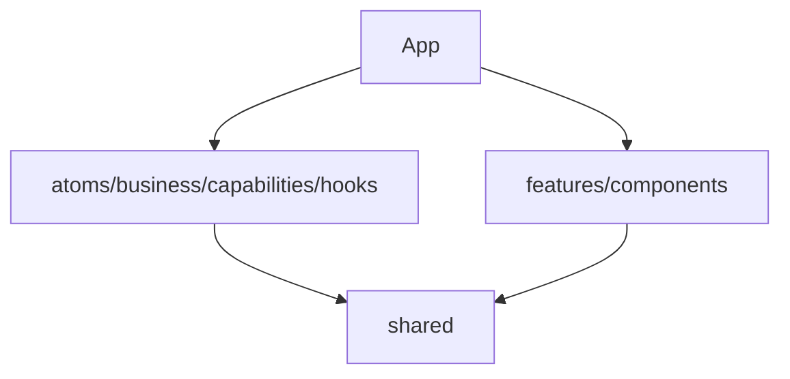
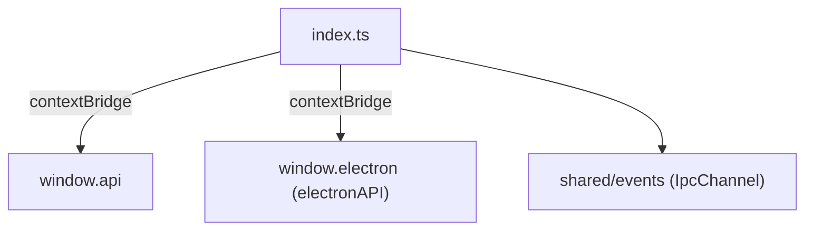
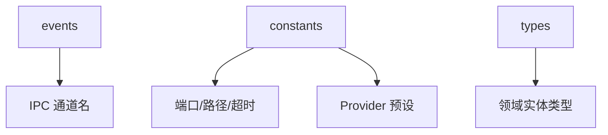
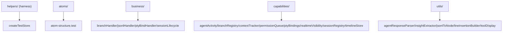

# Claude Steer - 技术设计文档 (TDD)

> **文档定位**：回答「**每个模块如何实现？（Implementation）**」，聚焦**技术实现**，不讨论产品价值（已在 MRD/PRD）。
>
> **来源依据**：基于已确认的 `docs/architecture.md` 与 `claude-driver/` 实际代码（代码先于文档开发）。所有 API、数据模型、状态机与 Architecture 模块边界一致。
>
> **块同步体系**：本文档顶层汇总。导航类（模块架构图/模块概览/API 概览）随块文件 sync 级联；细节类（数据模型/关键流程/状态机/异常处理/监控与测试）只留标题骨架，正文读对应块文件。

## 概述

### 设计原则

1. **代码即真相**：本文档描述代码实际行为、签名、类型，非理想设计。差异标注 `[待确认]`/`[占位]`/`[待清理]`。
2. **与 Architecture 一致**：所有 API/数据模型/状态机严格落在 Architecture 定义的模块边界内，不越界。
3. **IPC->Atom 桥接**：`useIpcBridge`(hooks) 注册监听 -> `business/`(factory) 转译 -> `capabilities/`(store 注入) 变更 atom + 持久化 sidecar。business/capabilities 接受 `store: Pick<TestStore,'get'|'set'>` 注入，可脱离 React/IPC 单测。
4. **原子配置写入**：全部配置统一「写临时文件 + 原子 rename + 字段级合并」。
5. **会话绑定双路**：主动 `autoWatchTranscript`（轮询 JSONL 出现）+ 被动 `SessionStart` Hook；双 Map `ptyToClaudeMap`/`claudeToPtyMap`。
6. **十类插入线**：`LineInsertion` 统一模型（思考层左/行动层右，颜色/方向/长度区分）。
7. **跨平台**：Hook 脚本 .sh/.ps1、claude bin 解析、任务栏角标三平台分支。

### 测试策略

- **框架**：Vitest（globals:true，environment:node，无 DOM 渲染）。
- **覆盖**：仅渲染层逻辑（atoms/business/capabilities/utils）。`createTestStore`/`createStoreWith` 隔离 Jotai store；`collectAtomValues` 记录副作用顺序。
- **覆盖缺口 [待补]**：无主进程测试（GitManager/PtyManager/JsonlParser/HookServer 等）、无组件测试、无 preload/IPC 注册表测试。

### 统一规范

- **IPC 通道名**：单一真相源 `shared/events/ipc-channels.ts`（~90 通道，`IPC` const + `IpcChannel` 联合），禁止硬编码。
- **配置路径**：`~/.claude-driver/`（代码当前），PRD §8.5 要求统一 `~/.claude-steer/` `[待统一]`。
- **Hook 端口**：39521（shared/constants HOOK_PORT）。
- **衍生持久化**：5 类 sidecar 文件（`.insertions.jsonl`/`subagents/agent-*.insertions.jsonl`/`.milestones.jsonl`/`.git-marks.jsonl`/`.meta.json`），均由 main/index.ts IPC handler appendFileSync 写入。

## main
<!-- parent: TDD -->
### 模块架构图

### 模块概览

- **职责**：主进程编排器。窗口、HTTP Hook Server、80+ IPC handler、PTY↔Claude 绑定、5 衍生持久化、依赖检测、启动流程。
- **输入**：IPC invoke（renderer）、HTTP POST（Claude Hook）、node-pty stdout。
- **输出**：IPC push（renderer）、PTY stdin、衍生 sidecar 文件、HTTP 响应。

### API 概览

- **编排函数**：`createWindow()`、`registerIpcHandlers()`、`startServices()`、`runDependencyCheck()`、`autoRescanProjects()`、`initUserSettings()`。
- **会话绑定**：`autoWatchTranscript(sessionId, projectPath, startTime, isPtyId?, parentPtyId?, expectedClaudeId?)`、`bindPtyToClaudeSession(ptyId, claudeId, transcriptPath, cwd)`、`unbindPtyFromClaudeSession(claudeId)`。
- **衍生持久化**：`replayInsertions(filePath)`、`getSubagentInsertionsPath(parentTranscriptPath, agentId)`。
- **Hook 处理**：`onHookEvent(payload)`（SessionStart/PreToolUse/PostToolUse/Subagent/Permission/Stop/SessionEnd/PostCompact 分发）、`handleTrustFolderPrompt(sessionId, data)`、`stripAnsi(str)`。
- **IPC handler 分组**（~80）：PROJECT_*（list/create/scan/update/history-scan）、SESSION_*（start/input/stop/resume/meta-write）、PTY_*（bind/unbind）、JSONL_*（watch/record/records/subagent-*/branch-snapshot）、GIT_*（commit/reset/ensure-repo/delete-commit/push/get-status/mark-*/marks-load）、INSERTION_*（append/patch/load/subagent-*）、MILESTONE_*（save/load）、CONFIG_*/DRIVER_CONFIG_*/PROVIDER_*/CLAUDE_SETTINGS_*/PROJECT_SETTINGS_*/MCP_*/SKILL_*、SCHEDULER_*、CC_CONNECT_*、INSIGHT_*/CHAT_*、TERM_*、UPDATER_*、RECOMMEND_GET、API_TEST*、DIALOG_*、SHELL_*、OPEN_WEBVIEW、TOKEN_SCAN_FILE。

### 数据模型
### 关键流程
### 状态机
### 异常处理
### 监控与测试

## renderer
<!-- parent: TDD -->
### 模块架构图

### 模块概览

- **职责**：渲染进程（Chromium + React）。状态逻辑层 + 业务 UI 层 + 根 App（hash 路由 + 3-tab + pop-out）。
- **输入**：IPC push（HOOK_EVENT/STATUS_LINE/JSONL_*/PTY_BIND/...）、用户交互。
- **输出**：IPC invoke（PROJECT_*/SESSION_*/GIT_*/CONFIG_*/...）、UI 渲染。

### API 概览

- **`App`**：hash 路由（`#/terminal`、`#/chat` pop-out 各自 JotaiProvider）+ 3-tab（global/project/notifications）+ 全局 overlay（GlobalSettingsModal/InitSopModal）。
- **状态逻辑层**：atoms（16）/ business（9）/ capabilities（11+utils5）/ hooks（6）。
- **业务 UI**：features（9）/ components（6）。

### 数据模型
### 关键流程
### 状态机
### 异常处理
### 监控与测试

## preload
<!-- parent: TDD -->
### 模块架构图

### 模块概览

- **职责**：ContextBridge IPC 包装。将 ipcMain handler 映射为类型安全 `window.api`（invoke/on/removeAllListeners）。安全模型：`contextIsolation` 默认开启，渲染进程不直接接触 ipcRenderer，仅获 3 个收窄方法 + @electron-toolkit/preload 的 electronAPI。
- **输入**：ipcMain.handle（main 注册）。
- **输出**：window.api（invoke/on/removeAllListeners）+ window.electron（electronAPI）。

### API 概览

- **`preload/index.ts`**
  - `window.api.invoke(channel: IpcChannel, ...args: unknown[]): Promise<unknown>` — Renderer->Main 双向请求
  - `window.api.on(channel: IpcChannel, listener: (...args: unknown[]) => void): (() => void)` — 订阅 Main->Renderer 推送；包裹 listener 去 IpcRendererEvent；返回退订函数
  - `window.api.removeAllListeners(channel: IpcChannel): void`
  - `process.contextIsolated` true 时用 contextBridge，否则直挂 window
- **`preload/index.d.ts`**
  - `window.electron: ElectronAPI`
  - `window.api: { invoke, on, removeAllListeners }`（同上签名）

### 数据模型
### 关键流程
### 状态机
### 异常处理
### 监控与测试

## shared
<!-- parent: TDD -->
### 模块架构图

### 模块概览

- **职责**：跨进程契约层。类型（types）+ 常量（constants）+ IPC 通道名（events）。被 main 与 renderer 共同引用（renderer 经 `@shared` 别名）。
- **输入**：无。
- **输出**：类型 + 常量 + IPC 通道名 + extractToolDisplay 纯函数。

### API 概览

- **`events/ipc-channels.ts`**：`IPC` as const（~90 通道）+ `IpcChannel` 联合类型。
- **`constants/index.ts`**：HOOK_PORT=39521、DRIVER_CONFIG_DIRNAME='.claude-driver'（[待统一]）、CLAUDE_CONFIG_DIRNAME='.claude'、STATUS_LINE_SCRIPT_NAME、PTY_TIMEOUT_MS=30min、HEARTBEAT_INTERVAL_MS=10s、PLAN_INDICATOR_TTL_MS=5min、HOOK_ENDPOINT='/hooks'、STATUS_LINE_ENDPOINT='/statusline'。
- **`constants/providers.ts`**：PROVIDER_PRESETS（6：anthropic/deepseek/openrouter/siliconflow/minimax/custom）+ PROVIDER_PRESET_LIST。
- **`types/index.ts`**：核心领域实体（Project/Session/PlanNode/AgentNode/Hook*/StatusLineData/Notification/DriverConfig/Provider*/FeishuBotConfig 等）。
- **`types/jsonl.ts`**：Jsonl* 类型 + `extractToolDisplay(toolUse: JsonlToolUse): ToolDisplayInfo` 纯函数。
- **`types/lineInsertion.ts`**：LineInsertion* 类型（10 类统一模型）。

### 数据模型
### 关键流程
### 状态机
### 异常处理
### 监控与测试

## __tests__
<!-- parent: TDD -->
### 模块架构图

### 模块概览

- **职责**：Vitest 测试套件，镜像渲染层结构。覆盖 atoms/business/capabilities/utils 纯逻辑单测。无 DOM 渲染（environment: node）。
- **输入**：createTestStore/createStoreWith 工厂 + 被测模块。
- **输出**：测试用例 + 断言。

### API 概览

- **`helpers/createTestStore.ts`**
  - `createTestStore(): TestStore` — 隔离 Jotai store 工厂
  - `createStoreWith(seeds: Array<[AnyAtom, unknown]>): TestStore` — 带初始值 seed
  - `collectAtomValues(store, atom): unknown[]` — 订阅并记录值历史（副作用顺序断言）
- **`helpers/setup.ts`**：`@testing-library/jest-dom` matchers 注册
- **`helpers/env.test.ts`**：Phase 0 harness 验证（store 独立性、get/set、window undefined）
- **测试文件**（见各目录对应模块 API）：
  - atoms/atom-structure.test：9 atom 初始值 + sessions.atom barrel re-export 向后兼容
  - business/{branchHandler,jsonlHandler,ptyBindHandler,sessionLifecycle}.test：状态机 + 事件路由 + 绑定路径 B/C
  - capabilities/{agentActivity,branchRegistry,contextTracker,permissionQueue,ptyBindings,realtimeVisibility,sessionRegistry,timelineStore}.test：store 操作单测
  - utils/{agentResponseParser,insightExtractor,jsonlToNode,lineInsertionBuilder,toolDisplay}.test：纯函数单测

### 数据模型
### 关键流程
### 状态机
### 异常处理
### 监控与测试
