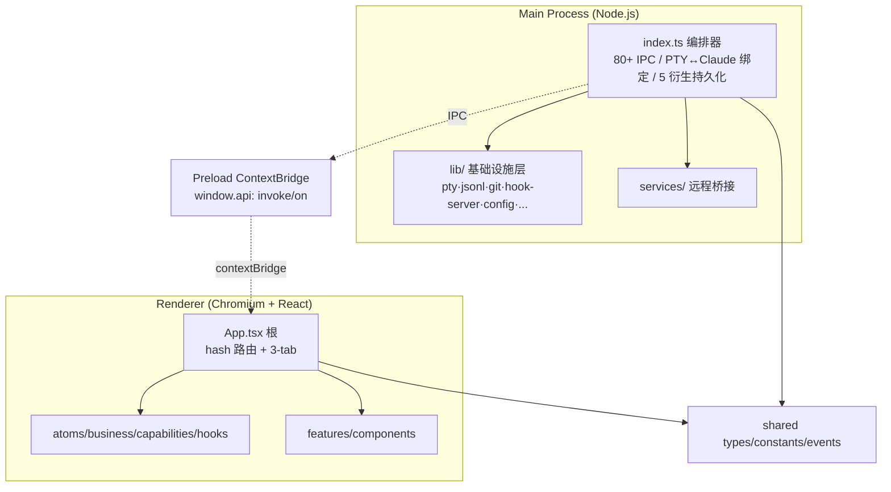
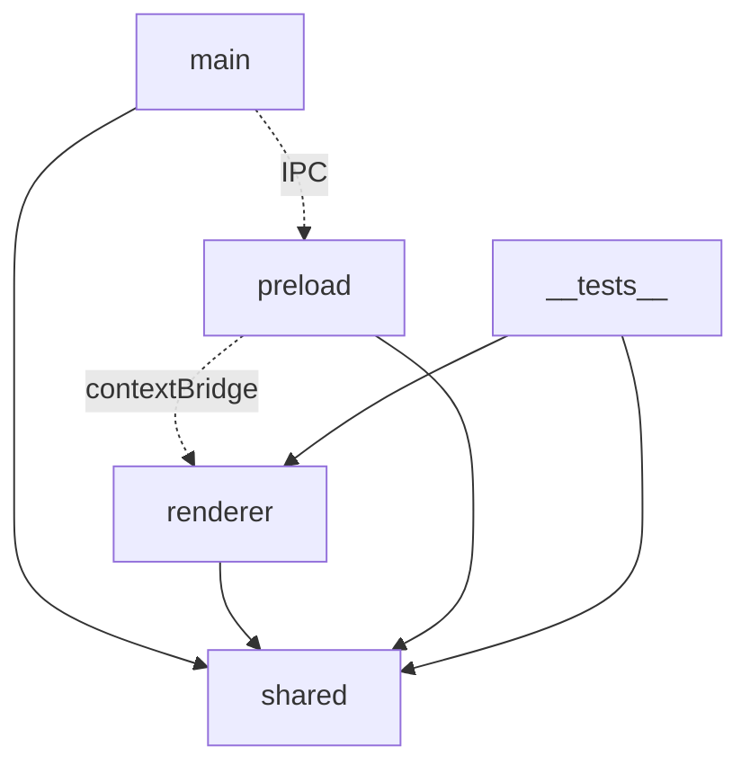

# Claude Steer - 架构设计 (Architecture Design)

> **文档定位**：回答「**系统应该如何组织？（System）**」，聚焦**系统架构**，不讨论接口细节和数据库细节（留到 TDD）。
>
> **来源依据**：基于已确认的 `docs/PRD.md` 与 `claude-driver/` 实际代码（代码先于文档开发，本文为代码实际结构的提炼）。旧版根目录 `架构.md`（Claude Driver v0.1.0-draft）部分内容已与当前代码不符（IPC 通道名、终端子窗口方案等），以代码为准。
>
> **块同步体系**：本文档顶层汇总。导航类内容（架构图/定位与职责/内部组成/依赖与联动）随块文件 sync 级联上探；细节类（技术选型/非功能约束）只留标题骨架，正文读对应块文件。

## 整体架构

### 设计哲学（为什么选用这个架构）

Claude Steer 的架构选择围绕一个核心判断：**Claude Code 自身已经是一套成熟的 Agent 引擎**（Hooks / statusLine / MCP / Subagents / Skills / Plan / JSONL 转录），它的底层机制经过大量用户验证，重新实现一套等价机制的成本高、同步维护负担重，且容易与官方更新脱节。因此架构的首要原则是 **"封装增强，而非重造"**——通过外部 Hook + 进程注入 + 文件系统监听三板斧，在不侵入 Claude Code 内部的前提下，获取等价的实时状态流。

这个核心判断派生出以下关键架构决策：

1. **为什么 Electron 三进程（Main / Preload / Renderer）而非纯 CLI 包装或 Web 应用**
   - 需要与 Claude Code **CLI 进程深度集成**（node-pty stdin/stdout 双向流、环境变量注入、Hook 脚本生成）——这是 Node.js 主进程的职责。
   - 需要**跨平台原生 UI**（Windows 任务栏 overlayIcon、macOS dock badge、系统托盘、独立 xterm 子窗口）——这是 Electron 主进程的优势。
   - 需要**高频实时渲染**（多 Agent 并发、十类插入线、时间线动画）——这是 Chromium + React 渲染进程的强项。
   - 三者通过 **Preload ContextBridge** 隔离：渲染进程不直接接触 Node 模块，`contextIsolation` 默认开启保证安全边界。

2. **为什么三通道融合（Hook / statusLine / JSONL）而非单一通道**
   - Hook 通道：低延迟（毫秒级），但依赖 HTTP POST 可靠性（短时高并发可能丢包）。
   - statusLine 通道：~300ms 周期刷新，提供 token/model/context_window 的强一致性，但只能反映当前时刻而非历史。
   - JSONL tail 通道：持久化历史记录，兜底断电重启、历史回放、拉动条数据源。
   - **三通道互为兜底**保证最终一致性——任一通道失效时，系统仍能正确工作（PRD §4.3 降级策略的架构支撑）。

3. **为什么 Jotai 而非 Redux / Zustand / MobX**
   - 实时数据流高频（Hook 事件 + statusLine + JSONL record 每秒数十条），需要**原子化精准 re-render**——Jotai 的 atom 订阅机制天然支持，避免 Redux 全局 state 树的整树 diff。
   - `atom(get => ...)` 派生模式让聚合逻辑（token 统计、agent 标签、plan 树）声明式表达，避免手写 selector 和 memoization。
   - `atomFamily` 按 sessionId/projectId 动态 keyed 状态，避免 Map 嵌套导致的渲染失控。

4. **为什么 IPC->Atom 桥接模式（`useIpcBridge` → `business/` → `capabilities/` → `store.set(atom)`）**
   - **副作用隔离**：`useIpcBridge` 是唯一持有 `useStore()` 的组合根（不可测），业务逻辑下沉到 `business/capabilities`，通过注入 `store: Pick<TestStore, 'get'|'set'>` 实现**脱离 React/IPC 的纯单测**。
   - **状态机集中**：Branch 握手三态、视口 4 态、Plan 指示器 3 态等复杂状态机在 `business/` 集中管理，避免散布到组件。
   - **持久化解耦**：`capabilities/` 内的 sidecar 持久化（insertions/milestones/git-marks/meta.json）是 fire-and-forget，主路径同步，持久化异步，避免阻塞渲染。

5. **为什么 `main/lib/` 按 SRP 拆为 11 个基础设施模块**
   - 每个模块封装一类与 Claude Code / 文件系统 / 系统集成的原子能力（PtyManager 只管 PTY、JsonlWatcher 只管 JSONL、GitManager 只管 git 命令……）。
   - 解耦带来**可替换性**（例如将 node-pty 换成其他 PTY 库只需改 pty/ 模块）和**可单测性**（每个模块独立）。
   - `index.ts` 仅做编排与 IPC 注册，不含业务逻辑——符合 Clean Architecture 的应用层/基础设施层分离。

6. **为什么 block_sync 采用 leaf-first 聚合排序**
   - 守护进程 `full_sync` 单次遍历迭代 `all_source_files()`（注册顺序），叶子块在前、根块在后，保证**父块被处理时已包含所有子块内容**——一次遍历即完成深度级联，无需 watcher 二次补偿。
   - 配合 selective hideRule（白名单导航类 ###），顶层汇总只保留导航内容，细节类只留标题骨架——保证 `docs/architecture.md` / `docs/TDD.md` 可快速浏览而细节按需读原文。

### 进程架构（Electron 三进程）

- **Main**：`index.ts` 编排入口（窗口、HTTP Hook Server、IPC 注册、PTY↔Claude 会话绑定、5 类衍生持久化写入）；`lib/` 基础设施层按 SRP 拆为 11 个机制模块；`services/` cc-connect 远程桥接。
- **Preload**：ContextBridge 暴露最小类型安全 `window.api`，`contextIsolation` 默认开启。
- **Renderer**：`atoms`(Jotai) + `business`(IPC 事件处理) + `capabilities`(原子变更+持久化) + `hooks`(React 胶水) 为状态逻辑层；`features` + `components` 为业务 UI 层。hash 路由支持 `#/terminal`、`#/chat` 独立 pop-out。
- **shared**：跨进程类型/常量/IPC 通道名契约。

### 三通道融合（实时状态同步核心）

1. **主通道·Hook 事件**：Main 进程 HTTP Server 监听 `127.0.0.1:39521`，启动时向 `~/.claude/settings.json` 注入 `type:"http"` Hook 配置，实时接收 PreToolUse/PostToolUse/SubagentStart/Stop/PermissionRequest 等。
2. **副通道·statusLine 桥接**：生成 `.sh`/`.ps1` 脚本注入 statusLine 字段，Claude Code 每 ~300ms 唤起，POST stdin JSON（token/model/context_window）刷新统计与上下文。
3. **兜底通道·JSONL 转录**：`chokidar` + tail 监听 `~/.claude/projects/<encoded-path>/<claudeId>.jsonl`（含 subagent），处理断电重启、历史回放、拉动条数据源。

三通道互为兜底，保证最终一致性。

### 全局技术选型

| 技术 | 角色 | 选型理由 |
|------|------|---------|
| electron-vite | 构建工具 | 三目标独立 HMR，规避 webpack rebundle |
| Jotai | 状态管理 | 原子化精准 re-render；`atom(get=>…)` 派生聚合 |
| node-pty | PTY 进程管理 | 跨平台伪终端，多 Claude 会话并发 + stdin 注入 |
| @xyflow/react | 无限画布 | 全局项目画板 + 项目历史进程线画布 |
| chokidar | 文件监听 | JSONL tail + 项目扫描，跨平台稳定 |
| xterm.js | 终端渲染 | 独立终端 pop-out 子窗口 |
| i18next | 国际化 | zh-CN/en，atom 驱动即时切换 |
| Vitest | 测试 | 渲染层 atoms/business/capabilities/utils 单测 |
| smol-toml | TOML 读写 | cc-connect config.toml 字段级合并 |
| electron-updater | 自动更新 | 手动下载模式 |

### 关键架构决策

1. **IPC->Atom 桥接**：`useIpcBridge` 注册 `ipcRenderer.on`，经 `business/`->`capabilities/`->`store.set(atom)` 更新；`business/capabilities` 接受注入 `store`，可无 React/IPC 单测。
2. **会话绑定双 Map**：`ptyToClaudeMap`/`claudeToPtyMap` 双向映射，主动 `autoWatchTranscript` + 被动 `SessionStart` Hook 双路建立，`claude -r` resume 亦能绑定。
3. **原子配置写入**：全部配置统一「写临时文件 + 原子 rename + 字段级合并」，防中途损坏。
4. **十类插入线统一模型**：`LineInsertion` 统一时间线 10 类元素（思考层左侧/行动层右侧）。
5. **Branch 链接握手三态**：`IDLE->PENDING_CONFIRM->PENDING_BIND->IDLE`，处理 IPC 时序竞态。
6. **跨平台**：Hook 桥接脚本 Unix curl+.sh / Windows PowerShell+.ps1；任务栏角标三平台分别实现。

## src
<!-- parent: architecture -->
### 架构图

### 定位与职责

- **职责**：Claude Steer 全部源码根，按 Electron 三进程 + 跨进程契约 + 测试五分。
- **边界**：负责组织 main/preload/renderer/shared/__tests__ 五大顶层模块及其依赖关系；不负责具体模块内部实现（见子级）。

### 内部组成

- **main**：Electron 主进程（Node.js）。编排器 `index.ts` + 基础设施层 `lib/`（11 机制模块）+ `services/`（远程桥接）。
- **renderer**：渲染进程（Chromium + React）。状态逻辑层（atoms/business/capabilities/hooks）+ 业务 UI（features/components）+ 根 `App.tsx`。
- **preload**：ContextBridge，暴露类型安全 `window.api`（invoke/on/removeAllListeners）。
- **shared**：跨进程类型、常量、IPC 通道名契约（events/constants/types）。
- **__tests__**：Vitest 测试套件，镜像渲染层结构（atoms/business/capabilities/utils + helpers）。

### 依赖与联动

- **内部依赖**：main 与 renderer 均依赖 shared（类型/常量/IPC 名）；preload 桥接 main↔renderer；__tests__ 依赖 renderer 与 shared。
- **通信方式**：main↔renderer 经 preload 的 `window.api`（ipcMain.handle / ipcRenderer.invoke 双向 + webContents.send 单向推送）。
- **关键交互场景**：①Hook 事件经 HookServer->HookEventBus->IPC.HOOK_EVENT 推送渲染层；②PTY 操作经 IPC.SESSION_* invoke 主进程 PtyManager；③JSONL 经 JsonlWatcher->IPC.JSONL_RECORD* 推送。

### 技术选型
### 非功能约束
