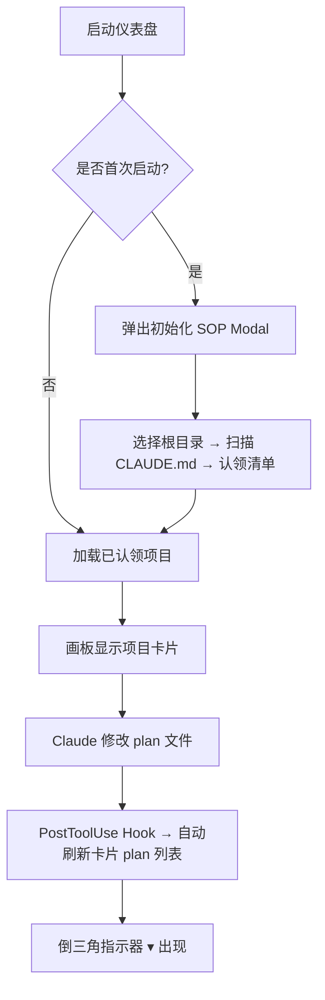
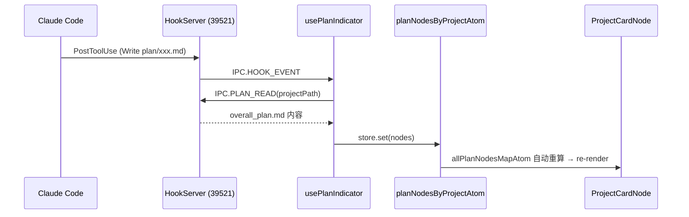

# M3 全局监控页面 — 使用指南

> **状态**：已完成 ✅  
> **完成日期**：2026-04-15

---

## 启动方式

```bash
source ~/.nvm/nvm.sh && nvm use 22
cd ~/CLAUDE_Steer/claude-driver
npm run dev
```

---

## 功能一览

### 左半：项目画板



| 元素 | 说明 |
|------|------|
| "我" 节点 | 画板中心用户节点，所有项目从此展开 |
| 大卡片（ProjectCardNode） | 所有已认领（claimStatus=1）项目，显示 M 级 plan 目标 |
| 绿色光晕 | 有 Running session 的项目 |
| 绿色 ▾（脉冲） | Claude 正在写入 plan 文件（active 状态） |
| 灰色 ▾ | 5min 内无 plan 变动（possibly-paused 状态） |
| 待确认角标 | claimStatus=0 的项目数量，点击触发认领流程 |
| ＋ 新建项目 | 打开 3 步创建向导 |

### 右半：配置面板

| 区域 | 内容 |
|------|------|
| 统计卡片 | 常用模型 / 本月 Token / 累计费用，点击展开项目分摊浮层 |
| Agent 面板 | 读取 `~/.claude/agents/` 目录的 agent 配置 |
| Skills 面板 | 读取 `~/.claude/skills/` 目录，超过 3 个时截断显示 |
| 工具面板 | Tools / MCP / CLI 三列，读取 `~/.claude/settings.json` |
| 功能入口 | ⏰定时触发 / 📡远程交互（cc-connect）/ 💫灵魂交流（/insights） |

---

## Plan 实时更新机制



**时序说明**：
- 启动时：`store.sub(claimedProjectsAtom)` 监听项目列表，列表填充后立即批量加载 plan
- 运行时：每次 Claude 写入 plan 文件触发 PostToolUse，自动重拉 overall_plan.md

---

## 创建新项目

1. 点击左下角 **＋ 新建项目**
2. Step 1 — 填写项目名称、路径、描述
3. Step 2 — 放入参考资料（可选，手动操作）
4. Step 3 — 确认后自动：
   - 创建项目目录 + CLAUDE.md + `.claude/settings.json`（acceptEdits 权限）
   - 启动 PTY 进程（claude CLI）
   - 发送「创建计划」指令

---

## 初始化 SOP（首次启动）

1. 选择根目录（如 `/home/tony`）
2. 扫描所有含 `CLAUDE.md` 的子目录（MAX_DEPTH=6，排除 node_modules 等）
3. 路径前缀去重（`/home/tony/proj` 与 `/home/tony/proj/sub` 只保留外层）
4. 认领清单：每个项目三态选择（✅认领 / ❌忽略 / ⚠️待定）
5. 持久化到 `~/.claude-driver/projects.json`
