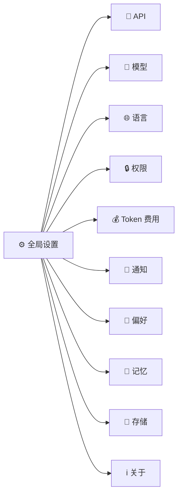
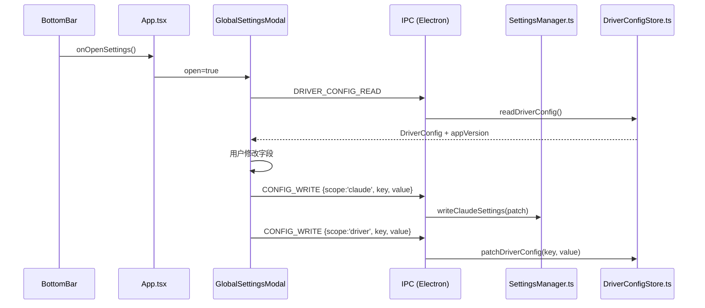

# M5 — 消息通知 + 全局设置 · 使用指南

> **完成日期**：2026-04-25
> **适用版本**：Claude Driver v0.1.0+

---

## 一、消息通知页面

### 功能说明

当 Claude Code Agent 发起权限请求（如执行 Shell 命令、写入文件等）时：

1. **桌面通知**：系统弹窗提醒（需系统通知权限）
2. **任务栏角标**：仪表盘图标显示待处理数量（macOS/Linux 数字；Windows 红点）
3. **通知页面**：底栏"💬 消息通知"Tab 显示角标，切换后可查看详情

### 使用步骤

```
底栏 → 💬 消息通知 Tab → 左侧列表选择请求 → 右侧详情 → 同意 / 拒绝
```

| 操作 | 说明 |
|------|------|
| **同意** | 直接通过，发送 `y` 到 PTY |
| **同意 + 附加信息** | 输入补充内容后一并发送 |
| **拒绝** | 发送 `n` 到 PTY，Claude 收到拒绝信号 |

> 审批后该条目自动从列表和 RequestApprovalPanel（项目监控左侧）同时消除（共享 `permissionRequestsAtom`）。

### 触发条件

- `PermissionRequest` Hook 事件到达时触发
- 桌面通知点击后自动切换到通知 Tab

---

## 二、全局设置 Modal

### 打开方式

```
底栏右侧 → ⚙ 全局设置 按钮
```

### 10 个配置分区



### 配置写入位置

| 分区 | 写入文件 |
|------|---------|
| API / 模型 / 语言 / 权限 / 输出样式 / 记忆 / 存储（天数） | `~/.claude/settings.json` |
| Token 单价 / 预算阈值 / 桌面通知开关 / 主题偏好 | `~/.claude-driver/config.json` |

### 保存流程

```
修改各分区字段 → 点击「保存」→ CONFIG_WRITE IPC → 按 scope 路由写入对应文件
```

> 修改后点击「保存」才生效。新 Session 启动时读取最新 `~/.claude/settings.json`，因此**模型/权限等修改对当前已运行的 Session 无效，需下次启动时生效**。

### 主题切换特别说明

主题切换为**即时生效**（纯 renderer 操作，直接修改 CSS 变量），点击后无需保存即可预览，点击「保存」后永久记录到 `config.json`。

### 配置导出/导入

| 操作 | 说明 |
|------|------|
| **导出配置** | 将 `~/.claude-driver/config.json` 复制到用户指定路径 |
| **导入配置** | 读取 JSON 文件 + 格式校验 + 写入 `config.json` + 自动刷新界面 |

> 仅导出/导入仪表盘自有配置（Token 单价、通知开关、主题等）；`~/.claude/settings.json` 不在导出范围内。

### API 连通性测试

在「API」分区输入 API Key 后，点击「测试连通性」：
- ✅ 成功：显示绿色「连通性正常 · {模型名}」
- ❌ 失败：显示红色错误信息（无效 Key / 网络超时等）

---

## 三、架构数据流


