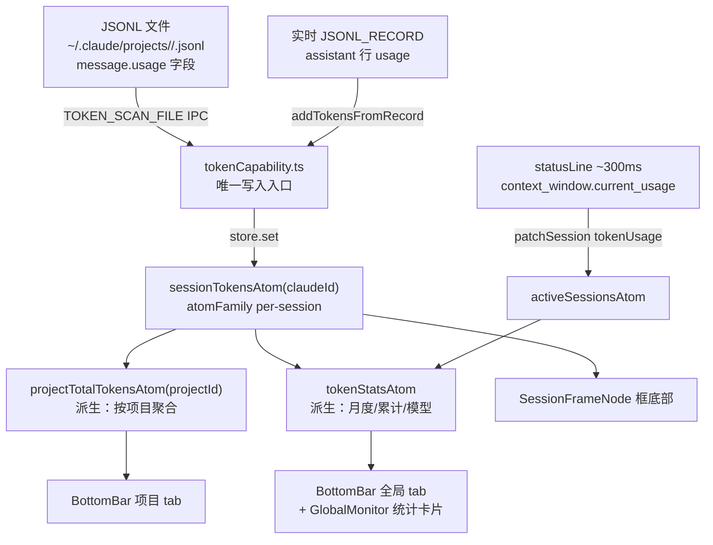

# M7 Token 统计 — 使用指南

## 功能概览

| 功能 | 位置 | 说明 |
|------|------|------|
| Session 框底部 token 显示 | 项目监控 → 每个 Session 框底部 | 运行中显示上下文窗口已用量；已完成显示累计总消耗 |
| 项目总 token 底栏统计 | 底部栏（项目监控 tab 时） | "这个项目的总token消耗 X tok" |
| 全局本月 token | 底部栏（全局监控 tab 时） | "本月 X tok" |
| 全局监控面板统计卡片 | 全局监控 → 右半配置面板 | 本月 Token / 累计费用 / 常用模型 |
| 价格配置 | ⚙ 全局设置 → Token 费用 | 修改后立即重算所有费用 |

---

## 数据流架构

---

## 启动时预加载

app 启动 → `useIpcBridge` → `PROJECT_LIST` → 对所有 `claimStatus=1` 项目：
1. `PROJECT_HISTORY_SCAN` 获取全部历史 session 的 `transcriptPath`
2. 写入 `activeSessionsAtom`（只写不存在的 entry）
3. 并发 `TOKEN_SCAN_FILE` 扫描每个 JSONL → 写入 `sessionTokensAtom`

全局统计面板**无需打开项目监控 tab** 即可显示真实数据。

---

## 三条写入路径

| 路径 | 触发时机 | 写入方式 | 防重复机制 |
|------|---------|---------|-----------|
| 历史扫描 | 启动时 / 打开项目时 | `Math.max`（取最大值） | 幂等，多次扫描不累加 |
| 实时增量 | `JSONL_RECORD` 到达 | 累加 | 每条新记录只到达一次 |
| statusLine | ~300ms 桥接推送 | 覆盖 `tokenUsage.current` | 不写 sessionTokensAtom |

> ⚠️ `JSONL_RECORDS`（历史批量重播）**不调用** `addTokensFromRecord`，防止每次打开项目重复累加。

---

## 关键文件

| 文件 | 职责 |
|------|------|
| `capabilities/tokenCapability.ts` | token 写入唯一入口（三条路径） |
| `atoms/stats.atom.ts` | sessionTokensAtom / projectTotalTokensAtom / tokenStatsAtom 定义 |
| `hooks/useIpcBridge.ts` | 启动时全量预扫描 |
| `hooks/useHistoryLoader.ts` | 打开项目时增量扫描（覆盖 useIpcBridge 未加载的旧 session） |
| `business/jsonlHandler.ts` | 实时增量 token 累加（handleRecord 调用，handleBatchRecords 不调用） |
| `business/statusLineHandler.ts` | context_window 写入 session.tokenUsage |
| `components/BottomBar/BottomBar.tsx` | 按 activeTab 条件显示月度/项目 token |
| `features/project-monitor/canvas/SessionFrameNode.tsx` | 框头部 + 底部 token 展示 |
