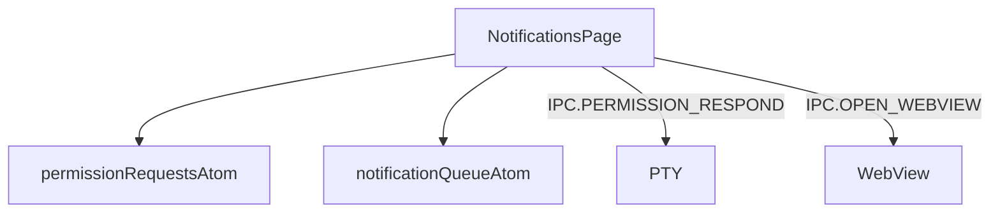
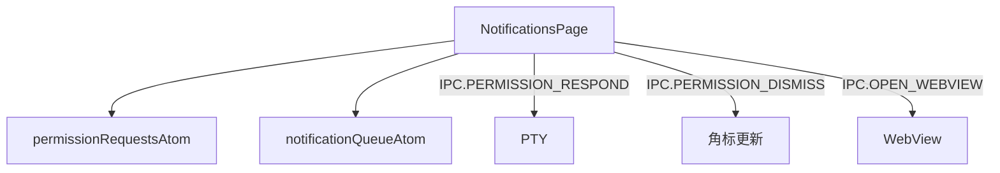
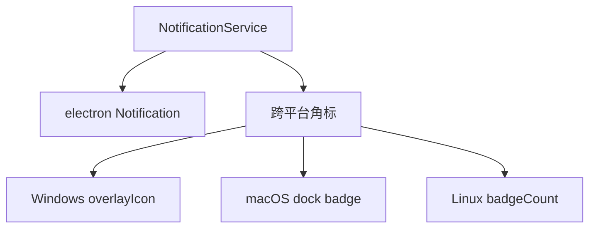

# M9 S2 — 修改 Architecture 类文档

> **目标**：更新 Architecture 文档，添加"聚合通知支持点击关闭"功能的技术描述
> **父计划**：M9 — 聚合通知支持点击关闭

---

## T1 — 修改渲染进程通知功能架构

**位置**：`.claude/rules/architecture/src/renderer/features/notifications.md`

**当前内容**：
```markdown
### 架构图



### 定位与职责

- **职责**：消息通知页。左侧权限请求列表（按 Agent 分组 + info 消息）+ 右侧详情（同意/同意带消息/不同意 + info 打开报告）。映射 PRD「消息通知界面」。
- **边界**：通知 UI；不负责桌面通知（main notification）。

### 内部组成

- **NotificationsPage.tsx**：读 permissionRequestsAtom/notificationQueueAtom；local selectedId；内部 NotificationList/NotificationDetail/InfoItem/InfoDetail。调 dequeueRequest capability。

### 依赖与联动

- **内部依赖**：atoms/notification + atoms/permission；capabilities/permissionQueue。
- **通信方式**：IPC.PERMISSION_RESPOND（TUI 按键序列 -> PTY stdin rawWrite；同意=回车，拒绝=Down×2+回车（`\x1b[B`，逐个按键间隔50ms），附加=Tab+文字+回车）；IPC.OPEN_WEBVIEW（insight 报告）。
- **关键交互场景**：权限请求 FIFO -> 审批 -> 注入；info 消息打开报告。

### 技术选型

React + 内部子组件（无外部 children）。

### 非功能约束

- **健壮性**：权限请求无超时（Agent 一直等待）；多请求 FIFO 堆叠。
```

**需要修改的内容**：

1. **架构图**：添加 `IPC.PERMISSION_DISMISS` 通道


2. **通信方式**：添加 `IPC.PERMISSION_DISMISS` 的描述
```markdown
- **通信方式**：IPC.PERMISSION_RESPOND（TUI 按键序列 -> PTY stdin rawWrite；同意=回车，拒绝=Down×2+回车（`\x1b[B`，逐个按键间隔50ms），附加=Tab+文字+回车）；IPC.PERMISSION_DISMISS（关闭通知，只更新角标，不发送按键）；IPC.OPEN_WEBVIEW（insight 报告）。
```

3. **关键交互场景**：添加"关闭"操作的描述
```markdown
- **关键交互场景**：权限请求 FIFO -> 审批 -> 注入；权限请求 -> 关闭 -> 角标更新；info 消息打开报告。
```

**修改原因**：
- 原架构只考虑了"审批"操作，现在需要支持"关闭"操作
- 关闭操作使用新的 `IPC.PERMISSION_DISMISS` 通道，只更新角标，不发送按键

---

## T2 — 修改主进程通知服务架构

**位置**：`.claude/rules/architecture/src/main/lib/notification.md`

**当前内容**：
```markdown
### 架构图



### 定位与职责

- **职责**：桌面通知 + 跨平台任务栏角标管理。映射 PRD「机制·系统通知推送」。
- **边界**：负责通知与角标；不负责应用内通知队列（renderer notification.atom）。

### 内部组成

- **NotificationService.ts**：init/notify/setBadge/incrementBadge/decrementBadge/resetBadge；主进程持有 `pendingCount`。

### 依赖与联动

- **内部依赖**：electron（app/nativeImage）；shared/events（IPC）。
- **通信方式**：由 index.ts 在 PermissionRequest Hook 触发 notify+increment、审批后 decrement；IPC.NOTIFICATION/NOTIFICATION_FOCUS_TAB 推送。
- **关键交互场景**：权限请求 -> 桌面通知 + 角标 +1；审批 -> 角标 -1；点击通知 -> 切换通知 tab。

### 技术选型

Electron 原生 Notification + 三平台角标 API（setOverlayIcon/dock.setBadge/setBadgeCount）。

### 非功能约束

- **当前限制 [待确认]**：`desktopNotificationsEnabled` 死开关（notify 不读此开关）
- **硬编码绑定**：当前角标计数语义硬编码为「待处理权限请求数」，非通用通知。
```

**需要修改的内容**：

1. **通信方式**：添加 `IPC.PERMISSION_DISMISS` 的描述
```markdown
- **通信方式**：由 index.ts 在 PermissionRequest Hook 触发 notify+increment、审批后 decrement、关闭后 decrement；IPC.NOTIFICATION/NOTIFICATION_FOCUS_TAB 推送。
```

2. **关键交互场景**：添加"关闭"操作的描述
```markdown
- **关键交互场景**：权限请求 -> 桌面通知 + 角标 +1；审批 -> 角标 -1；关闭 -> 角标 -1；点击通知 -> 切换通知 tab。
```

**修改原因**：
- 关闭操作也会调用 `decrementBadge`，需要在架构文档中说明
- 需要明确关闭操作的角标更新行为

---

## 执行步骤

1. 打开 `.claude/rules/architecture/src/renderer/features/notifications.md`
2. 修改架构图，添加 `IPC.PERMISSION_DISMISS` 通道
3. 修改"通信方式"，添加 `IPC.PERMISSION_DISMISS` 的描述
4. 修改"关键交互场景"，添加"关闭"操作的描述
5. 打开 `.claude/rules/architecture/src/main/lib/notification.md`
6. 修改"通信方式"，添加关闭操作的描述
7. 修改"关键交互场景"，添加"关闭"操作的描述
8. 运行 block-sync 确保上层文档同步更新

---

## 验证标准

- Architecture 文档中"渲染进程通知功能架构"包含 `IPC.PERMISSION_DISMISS` 的描述
- Architecture 文档中"主进程通知服务架构"包含关闭操作的描述
- 架构图正确反映了新的通信方式
- block-sync 运行成功，上层文档已同步更新
