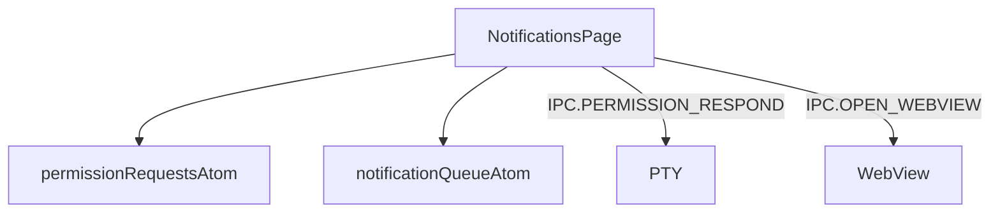
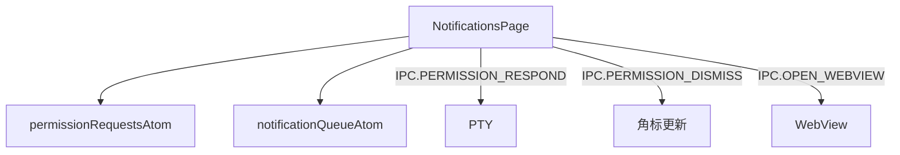
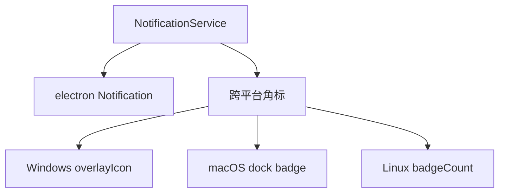

# M9 S3 — 修改 TDD 类文档

> **目标**：更新 TDD 文档，添加"聚合通知支持点击关闭"功能的技术实现细节
> **父计划**：M9 — 聚合通知支持点击关闭

---

## T1 — 修改渲染进程通知功能 TDD

**位置**：`.claude/rules/tdd/src/renderer/features/notifications.md`

**当前内容**：
```markdown
### 模块架构图



### 模块概览

- **职责**：消息通知页。左侧权限请求列表（按 Agent 分组 + info 消息）+ 右侧详情（同意/同意带消息/不同意 + info 打开报告）。
- **输入**：atoms（permission/notification）。
- **输出**：UI 渲染 + IPC invoke。

### API 概览

- **`NotificationsPage`**：读 permissionRequestsAtom/notificationQueueAtom；state `{ selectedId }`；调 dequeueRequest capability；内部 NotificationList/NotificationDetail/InfoItem/InfoDetail。

### 数据模型

- 见 atoms（PermissionRequest/Notification）。

### 关键流程

- 权限请求 FIFO -> 审批 -> IPC.PERMISSION_RESPOND（TUI 按键序列 -> PTY stdin rawWrite）
- **权限响应真实机制**（实测验证，日志 `~/.claude-driver/permission-debug.log`）：
  - 时序：Claude 欲用工具 -> PreToolUse hook fire -> 无 hook 决策 -> Claude 弹 TUI（❯ 1.Yes 默认聚焦 / 2.Yes-and-don't-ask / 3.No；底部 "Esc to cancel · Tab to amend"）-> ~2s 后 PermissionRequest hook fire -> 驱动 app 审批面板（面板显示时 TUI 已就绪，无竞态）
  - 按键映射（rawWrite 逐个发送，不追加 \r，每个按键间隔 ~50ms）：同意=`\r`；拒绝=`\x1b[B`×2+`\r`；同意+附加=`\t`+msg+`\r`；拒绝+附加=`\x1b[B`×2+`\t`+msg+`\r`
  - **关键发现**：**按键时间间隔是核心**——一次性写入所有字节会导致 TUI 无法逐个处理，全部忽略变成"同意"。必须 for 循环逐个 rawWrite + await sleep(50ms)。`\x1b[B`（普通模式）和 `\x1bOB`（应用光标模式）在有延时的情况下都能工作。
  - **禁止发 y/n 字母**：TUI 是选项型交互，字母被忽略（原 bug 根因之一）
  - **单实例约束**：HookServer 端口 39521 唯一，多实例会导致 hook 路由到另一实例，本实例面板不显示
- info 消息 -> IPC.OPEN_WEBVIEW（insight 报告）

### 状态机

无。

### 异常处理

- 权限请求无超时（Agent 一直等待）；多请求 FIFO 堆叠。

### 监控与测试

无。
```

**需要修改的内容**：

1. **模块架构图**：添加 `IPC.PERMISSION_DISMISS` 通道


2. **关键流程**：添加"关闭"操作的流程
```markdown
### 关键流程

- 权限请求 FIFO -> 审批 -> IPC.PERMISSION_RESPOND（TUI 按键序列 -> PTY stdin rawWrite）
- **权限响应真实机制**（实测验证，日志 `~/.claude-driver/permission-debug.log`）：
  - 时序：Claude 欲用工具 -> PreToolUse hook fire -> 无 hook 决策 -> Claude 弹 TUI（❯ 1.Yes 默认聚焦 / 2.Yes-and-don't-ask / 3.No；底部 "Esc to cancel · Tab to amend"）-> ~2s 后 PermissionRequest hook fire -> 驱动 app 审批面板（面板显示时 TUI 已就绪，无竞态）
  - 按键映射（rawWrite 逐个发送，不追加 \r，每个按键间隔 ~50ms）：同意=`\r`；拒绝=`\x1b[B`×2+`\r`；同意+附加=`\t`+msg+`\r`；拒绝+附加=`\x1b[B`×2+`\t`+msg+`\r`
  - **关键发现**：**按键时间间隔是核心**——一次性写入所有字节会导致 TUI 无法逐个处理，全部忽略变成"同意"。必须 for 循环逐个 rawWrite + await sleep(50ms)。`\x1b[B`（普通模式）和 `\x1bOB`（应用光标模式）在有延时的情况下都能工作。
  - **禁止发 y/n 字母**：TUI 是选项型交互，字母被忽略（原 bug 根因之一）
  - **单实例约束**：HookServer 端口 39521 唯一，多实例会导致 hook 路由到另一实例，本实例面板不显示
- **关闭操作**：权限请求 -> 点击"关闭"按钮 -> IPC.PERMISSION_DISMISS -> 主进程 decrementBadge -> 通知从列表消失（Agent 继续等待，不发送任何按键）
- info 消息 -> IPC.OPEN_WEBVIEW（insight 报告）
```

**修改原因**：
- 原 TDD 只考虑了"审批"操作，现在需要支持"关闭"操作
- 关闭操作是纯 UI 操作，不涉及 PTY stdin，需要在 TDD 中明确说明

---

## T2 — 修改主进程通知服务 TDD

**位置**：`.claude/rules/tdd/src/main/lib/notification.md`

**当前内容**：
```markdown
### 模块架构图



### 模块概览

- **职责**：桌面通知 + 跨平台任务栏角标管理。
- **输入**：main/index.ts 在 PermissionRequest Hook 触发 notify+increment、审批后 decrement。
- **输出**：桌面通知（electron Notification）、任务栏角标。

### API 概览

- **`const NotificationService`**（对象式 API）
  - `init(getWindow: GetWindow): void`
  - `notify(title: string, body: string): void`
  - `setBadge(n: number): void`
  - `incrementBadge(): void`
  - `decrementBadge(): void`
  - `resetBadge(): void`

### 数据模型

- **`GetWindow`**：`() => BrowserWindow | null`。
- **`pendingCount`**（internal）：主进程持有角标计数。

### 关键流程

1. PermissionRequest Hook -> notify + incrementBadge
2. 用户审批 -> decrementBadge
3. 点击桌面通知 -> IPC.NOTIFICATION_FOCUS_TAB（切通知 tab）

### 状态机

无。

### 异常处理

- **当前限制 [待确认]**：`desktopNotificationsEnabled` 死开关（notify 不读此开关）
- 角标计数硬编码为「待处理权限请求数」语义

### 监控与测试

- **日志点**：notify/increment/decrement。
- **测试缺口 [待补]**：NotificationService 无单测（依赖 electron API）。
```

**需要修改的内容**：

1. **模块概览**：更新输入描述
```markdown
### 模块概览

- **职责**：桌面通知 + 跨平台任务栏角标管理。
- **输入**：main/index.ts 在 PermissionRequest Hook 触发 notify+increment、审批后 decrement、关闭后 decrement。
- **输出**：桌面通知（electron Notification）、任务栏角标。
```

2. **关键流程**：添加"关闭"操作的流程
```markdown
### 关键流程

1. PermissionRequest Hook -> notify + incrementBadge
2. 用户审批 -> decrementBadge
3. 用户关闭 -> decrementBadge（IPC.PERMISSION_DISMISS）
4. 点击桌面通知 -> IPC.NOTIFICATION_FOCUS_TAB（切通知 tab）
```

**修改原因**：
- 关闭操作也会调用 `decrementBadge`，需要在 TDD 中明确说明
- 需要更新模块概览的输入描述

---

## 执行步骤

1. 打开 `.claude/rules/tdd/src/renderer/features/notifications.md`
2. 修改模块架构图，添加 `IPC.PERMISSION_DISMISS` 通道
3. 修改"关键流程"，添加"关闭"操作的流程
4. 打开 `.claude/rules/tdd/src/main/lib/notification.md`
5. 修改"模块概览"，更新输入描述
6. 修改"关键流程"，添加"关闭"操作的流程
7. 运行 block-sync 确保上层文档同步更新

---

## 验证标准

- TDD 文档中"渲染进程通知功能"包含"关闭"操作的流程描述
- TDD 文档中"主进程通知服务"包含"关闭"操作的流程描述
- 模块架构图正确反映了新的通信方式
- block-sync 运行成功，上层文档已同步更新
