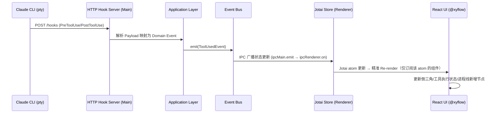

# Claude Driver — 全栈软件架构设计方案 (DDD & Clean Architecture)

> **版本：** v0.1.0-draft  
> **设计目标：** 工业级、可落地、高扩展的全栈软件架构，基于 DDD 与 Clean Architecture 构建。  
> **底层驱动：** 深度融合 Claude Code 官方架构设计（Hooks、statusLine、MCP、七层内存架构、多 Agent 编排）。  
> **已确认技术选型：** 构建工具 `electron-vite`，状态管理 `Jotai`，目标兼容 **Claude Code ≥ 2.1.104**。

---

## 1. 架构设计哲学与原则

本架构遵循 **Clean Architecture（整洁架构）** 和 **DDD（领域驱动设计）** 原则，以保证高内聚、低耦合、易维护和可测试性。

- **依赖倒置原则 (DIP)**：UI 层和基础设施层依赖于核心领域层，领域层不依赖任何外部框架。
- **单一职责原则 (SRP)**：每个模块只处理一类特定事务（如：JSONL 只负责解析，PTY 只负责进程 IO）。
- **第一性原理设计**：严格遵循 Claude Code 的官方机制，不"重复造轮子"。例如，状态同步强依赖 `PostToolUse` Hook，Token 统计依赖 `statusLine` 注入。
- **响应式事件驱动**：基于单向数据流和全局 EventBus，实现跨进程（Main ↔ Renderer）的实时状态同步。

---

## 2. 领域驱动设计 (DDD) 建模

### 2.1 限界上下文 (Bounded Contexts)

我们将系统划分为四个核心限界上下文：

1. **工作区上下文 (Workspace Context) [核心域]**
   - 负责项目、会话 (Session)、Agent 实例的管理。
   - 管理项目认领状态、计划 (Plan) 树。
2. **进程与通信上下文 (Process & IPC Context) [支撑域]**
   - 负责与底层 Claude Code CLI 的进程级交互 (node-pty)。
   - 负责 Hook 接收 (HTTP Server)、statusLine 解析、JSONL 历史转录。
3. **资产与版本上下文 (Asset & VCS Context) [通用域]**
   - 负责 Git Worktree 映射、版本快照、回退机制。
   - 文件系统的监听 (Chokidar)。
4. **扩展与配置上下文 (Extension & Config Context) [通用域]**
   - 负责全局配置、MCP (Model Context Protocol) 注册、Skills、Plugins 以及定时任务 (Cron)。

### 2.2 核心聚合根与实体 (Aggregates & Entities)

- **Project (聚合根)**
  - *Value Objects*: `ProjectPath`, `ClaimStatus` (1, 0, -1), `Settings`
  - *Entities*: `Session`, `PlanTree`
- **Session (实体)**
  - *属性*: `SessionId`, `Status` (Running, Paused, Interrupted, Completed), `CurrentAgent`
  - *Value Objects*: `TokenUsage`, `ContextState`
- **AgentNode (实体 - 对应多 Agent 树)**
  - *属性*: `AgentId`, `Type` (General, Explore, Plan), `ParentId` (支持 Coordinator 模式)
- **PlanNode (实体)**
  - *属性*: `PlanId`, `Description`, `Status` (TODO, DOING, DONE), `Level` (M/S/T)
- **WorktreeMap (实体)**
  - *属性*: `SessionId`, `WorktreePath`, `BranchName`

---

## 3. 整洁架构分层 (Clean Architecture)

系统采用典型的 Electron 架构（Main Process + Renderer Process），但在逻辑上统一遵循整洁架构的分层：

### 3.1 领域层 (Domain Layer)
- 纯 TypeScript 编写，无 Electron/Node/React 依赖。
- 包含实体定义、值对象、领域异常（Domain Exceptions）。
- **接口契约 (Repository Interfaces)**：如 `IProjectRepository`, `IProcessManager`, `ISessionTranscriptReader`。

### 3.2 应用层 (Application Layer / Use Cases)
- 编排领域对象，实现业务用例。
- 包含：`CreateProjectUseCase`, `SyncPlanStatusUseCase`, `DispatchAgentUseCase`, `RevertGitVersionUseCase`。
- **Event Bus**：定义领域事件（如 `PlanUpdatedEvent`, `ToolUsedEvent`, `SessionInterruptedEvent`）。

### 3.3 基础设施层 (Infrastructure Layer)
- 负责接口契约的具体实现。
- **ProcessManagerImpl**：基于 `node-pty` 派生子进程，持有 `stdin/stdout`。
- **HookServerImpl**：基于 `express`/`http` 在主进程监听 `39521` 端口，接收 Claude 的 Hook POST 请求。
- **JsonlReaderImpl**：基于 `fs.watch` 和流式读取，解析 `~/.claude/projects/<hash>/*.jsonl`。
- **GitManagerImpl**：执行 `git worktree`, `git add/commit/reset` 等 CLI 命令。
- **ConfigStoreImpl**：读写 `~/.claude-driver/projects.json` 及 `settings.json`。

### 3.4 表现层 (Presentation Layer)
- **构建工具**：**electron-vite**（主进程 / Preload / 渲染进程三路独立 HMR，避免 webpack 的 rebundle 等待）。
- **Electron Main**：管理窗口、系统托盘、系统级通知。
- **Electron Preload**：提供 ContextBridge，实现安全的 IPC 通信（IPC Main ↔ IPC Renderer）。
- **React Renderer**：
  - **状态管理：Jotai（✅ 已确认）**
    - 采用**原子化状态**设计，每个实时数据流（Hook 事件、statusLine、JSONL）对应独立 atom family，精准控制 re-render 范围。
    - **IPC→Atom 桥接模式**：在 React 根组件挂载时，注册 `ipcRenderer.on(channel, handler)` 监听，handler 内通过 `store.set(atom, newValue)` 更新原子。
    - 关键 Atom 设计：
      ```
      projectsAtom          → Map<ProjectId, ProjectState>  (全局画板)
      activeSessionsAtom    → Map<SessionId, SessionState>  (进程线数据)
      planTreeAtom          → Map<ProjectId, PlanTree>      (plan 状态)
      tokenStatsAtom        → GlobalTokenStats              (统计看板)
      notificationQueueAtom → Notification[]               (通知队列)
      ```
    - **跨 Atom 计算**：使用 `atom(get => ...)` 派生 atom 做 totalCost、mostUsedModel 等计算，避免在组件中重复聚合逻辑。
  - **无限画板使用场景（两处）**：
    1. **全局监控页左侧画板**：`@xyflow/react`，渲染项目卡片节点 + 用户节点连线。
    2. **项目监控页右半进程线画布**：`@xyflow/react`，渲染 Session 框节点 + Subagent 连线 + 框间并行布局；需要程序化 zoom/pan 控制（详见 4.9）。
  - **项目监控页左半当前工作情况面板层②**：CSS `overflow-y: auto` 无限滚动（不需要缩放，只需 `scrollIntoView` 跟随）。
  - **终端/进程视图**：将 JSONL + Hook 事件流式渲染为 @xyflow/react 的自定义节点，每个 Session 是一个可动态改变高度的 resizable 节点。
    - 关键 Atom 补充（项目监控页专用）：
      ```
      processLineInsertionsAtom → Map<SessionId, LineInsertion[]>   (十类插入元素队列)
      messageQueueAtom          → Map<SessionId, string[]>          (消息队列，FIFO)
      insightAtom               → Map<SessionId, InsightEntry[]>     (insight 条目)
      contextPanelAtom          → Map<SessionId, ContextComponent[]> (上下文面板组件列表)
      activeAgentBlockAtom      → Map<SessionId, AgentBlockState>   (当前工作情况面板各 Agent 状态)
      ```
    - **LineInsertion 数据结构**（十类插入元素的统一模型）：
      ```typescript
      interface LineInsertion {
        type: 'tool' | 'mcp' | 'cli' | 'skill' | 'workflow' | 'insight'
              | 'subagent' | 'branch' | 'btw' | 'user-input'
        direction: 'left' | 'right'          // 时间轴插入方向
        color: '#e6430d' | '#DA7756'          // 工具类右侧=橙红；体验/交互类左侧=暖橙
        length: 'short' | 'medium' | 'long'  // 短=1单位/中=2单位/长=3单位
        sessionId: string
        timestamp: number
        badgeContent: Record<string, string>  // 工具名、操作描述等
        status: 'pending' | 'running' | 'done' | 'failed'
        isAnimating: boolean                  // 琥珀色闪烁 + ⟳ 后缀
      }
      ```

---

## 4. 核心技术实现方案（基于 Claude Code 特性）

### 4.1 实时数据与状态同步引擎 (三通道融合)

架构设计中最核心的是如何无损、实时地获取 Claude Code 的状态。采用**三通道融合架构**：

1. **主通道：Hook 事件驱动 (HTTP Server)**
   - **机制**：在主进程启动 39521 端口 HTTP 服务器。启动时自动向 `~/.claude/settings.json` 注入 `type: "http", url: "http://127.0.0.1:39521/hooks"`。
   - **作用**：实时接收 `PreToolUse`, `PostToolUse` (包含 Plan 更新), `SubagentStart/Stop` 等事件，实现 Agent 启停和 Plan 倒三角指示器的毫秒级更新。
2. **副通道：statusLine stdin 桥接**
   - **机制**：向配置注入 statusLine 自定义脚本，该脚本被 Claude Code 每 300ms 唤起一次，将其 stdin (包含 token 用量、当前模型、上下文信息) 通过 HTTP POST 转发给主进程的 39521 端口。
   - **作用**：实时刷新 Token 统计、费用看板和上下文使用量（精确对接 Claude 的七层内存架构中的 Layer 1 状态）。
3. **兜底通道：JSONL 转录监听与解析**
   - **机制**：使用 `chokidar` + `tail` 机制监听 `~/.claude/projects/<hash>/<session>.jsonl` 及 subagents 的 jsonl。
   - **作用**：处理断电重启、历史回顾、以及拉动条的数据源。用于渲染单条/多条进程线。

### 4.2 多 Agent 并发与进程线渲染

根据 Claude Code 的 Coordinator 模式与 Task 工具：
- 父 Agent 发送 Task 给子 Agent 时，会触发 `SubagentStart` Hook。
- UI 层监听到该 Hook，在画布上为该 Session 动态派生一条**嵌套子进程线**（mini node），并在左侧状态面板新增一个执行 Block。
- 进程线画布**使用** `@xyflow/react`，每个 Session 框作为一个自定义 Node，支持程序化 `setViewport` / `fitView` 实现缩放聚焦（详见 4.9）。

#### 4.2.1 三种并行情形的布局策略

| 情形 | 布局 | 连线 |
|------|------|------|
| 单主线程 | 单框居中 | 无 |
| `/branch` 继承记忆 | 两框并排，branch 框 `margin-top` 与 `/branch` 触发点对齐 | 水平连线（渐变紫色，2px）+ 「继承记忆」标签 |
| 同项目多 Session 并行 | 两框并排，顶部对齐 | 2px 竖向细分隔线（无标注） |

颜色系统（多框区分）：Agent1=绿色系 / Agent2=蓝色系 / /branch Session=紫色系。

#### 4.2.2 十类插入元素（A-J）架构概述

每个 Claude 回复节点之间，根据实际触发情况动态插入以下十类元素，每类对应不同颜色/方向/长度的插入线 + 内容 badge：

| 类别 | 颜色 | 方向 | 长度 | 识别来源 |
|------|------|------|------|---------|
| A. Tools 调用 | `#e6430d` | 右侧 | 短 | `PreToolUse`/`PostToolUse` Hook |
| B. MCPs 调用 | `#e6430d` | 右侧 | 中 | `PreToolUse` Hook，工具名含 `mcp__` 前缀 |
| C. CLI 调用 | `#e6430d` | 右侧 | 长 | Skill 工具调用，且 skill 名包含 `cli` 字符串（`~/.claude/skills/` 下扫描识别） |
| D. Skills 调用 | `#DA7756` | 左侧 | 短 | `Skill` 工具调用（排除 CLI 分类） |
| E. 工作流调用 | `#DA7756` | 左侧 | 中 | Hook 事件触发，来自 settings.json hooks 配置 |
| F. Insight 产生 | `#DA7756` | 左侧 | 长 | 从 Claude 回复文本中提取 insight 段落（详见 4.5） |
| G. Subagent 调用 | `#DA7756` | 左侧 | 长 | `SubagentStart`/`SubagentStop` Hook；返回时追加一条反向连线 |
| H. /branch | `#DA7756` | 左侧 | 长 | PTY stdout 检测 "Branched─conversation"（`/Branched[\s\u2500\-]+conversation/i`）；**不经过** `UserPromptSubmit` Hook |
| I. /btw | `#DA7756` | 左侧 | 长 | `UserPromptSubmit` + 正则匹配 `/btw` |
| J. 用户输入 | `#DA7756` | 左侧 | 长 | `UserPromptSubmit` Hook |

**同时触发多个相同类别**（如同时调用 3 个 Tools）：按顺序各自插入一条线，类别内顺序无严格要求。

#### 4.2.3 Subagent Mini 进程线架构

- **触发**：`SubagentStart` Hook 携带 `agent_id`，在主线派发节点后插入 mini 进程线。
- **结构**：传入标签（紫色斜体）→ Mini 节点（缩小一档，规则与主线一致）→ 返回标签（绿色斜体）。
- **折叠/展开**：默认折叠（仅显示 [Subagent 名称] + 摘要），点击展开完整 mini 进程线。
- **数据来源**：子 agent 的工具调用归属于子 agent 自己的 session JSONL（`<session-uuid>/subagents/<subagent-uuid>.jsonl`），通过 `agent_id` 区分，不污染主线数据。

### 4.3 当前工作情况面板（左半）四层布局架构

左半面板采用 flex 纵向四层布局，`overflow: hidden`，无外部滚动条：

| 层级 | 组件 | Flex 属性 | 数据来源 |
|------|------|-----------|---------|
| ① 执行计划折叠区 | Plan 树（折叠态 30px / 展开态 max 200px） | `flex-shrink:0` | `D5` Plan 文件解析 + `SM3/SM4` 状态同步 |
| ② 当前工作情况区 | 各 Agent Block（无限画板，每个 Block 含工具框/经验框/Subagent 状态/Insight 块/输入行/打断按钮） | `flex:1, overflow-y:auto` | `D2` statusLine + `D13` 工具调用详情 + `E2` 事件总线 |
| ③ Agent 请求审批框 | 权限请求 UI（FIFO 堆叠） | `flex-shrink:0`，仅权限请求时显示 | `E4` 权限请求事件 + `PermissionRequest` Hook |
| ④ 上下文面板 | 组件列表（System/CLAUDE.md/Memory 等） | `flex-shrink:0, max-height:100px, overflow-y:auto` | `C1-C4` 上下文管理模块 + `T7` token 估算 |

**底部状态栏**（位于四层布局之外，height ~20px）：显示工作状态词 + 实时任务摘要，数据来源为 statusLine `cwd` + 最新 Hook 事件。

#### 4.3.0 打断按钮完整流程

「打断」按钮目标：干净地结束当前 Claude Code session，释放 PTY，解绑 IPC 映射。

```
用户点击打断
  → IPC.SESSION_STOP { ptySessionId }
  → 主进程：
      1. PTY stdin 写入 "\x03\x03"（连续两次 Ctrl+C）
      2. setTimeout 500ms（等 Claude Code 响应 Ctrl+C 并退出）
      3. pty.kill()（强制关闭 PTY 进程）
      ※ 不手动 unbind：PTY 退出后 Claude Code 自然发 SessionEnd hook，由 hook 链路处理
  → Claude Code 发出 SessionEnd hook
  → 主进程 hook handler：unbindPtyFromClaudeSession(claudeId)
      → PTY_UNBIND { ptyId, claudeId } 推送渲染层
  → 渲染层 useIpcBridge：
      SessionEnd handler：activeSessionsAtom 将 session 状态改为 Interrupted（保留历史进程线）
      PTY_UNBIND handler：仅清 ptyBindingsAtom 双向映射，不改 session 状态
      LeftPanel AgentBlock 消失（过滤器排除非 Running/Paused）

⚠️ PTY_UNBIND handler 禁止修改 session 状态：
   branch 时父 PTY 也会发 PTY_UNBIND（旧 claudeId 解绑），若此处改状态，
   branch 后父 PTY 的 AgentBlock 会立刻消失，实时面板变空白。
```

#### 4.3.1 消息队列机制（Message Queue）

- 每个 Agent Block 有独立输入框，用户随时可以输入。
- 监听 `Stop` Hook（Claude 完成当前响应的信号），收到后自动从队列取出最老的消息注入会话（通过 PTY stdin）。
- 多 Agent 并行时各自维护独立队列，互不影响。
- 实现参见 PRD 附录 D.8：`Q1`（入队）、`Q2`（出队，Stop 触发）、`Q3`（注入 PTY）。

#### 4.3.2 「回到此 Session」按钮流程（历史进程线框头部）

```
用户点击 SessionFrameNode 框头部「回到此 Session」
  → IPC.SESSION_RESUME { projectId, projectPath, claudeId: 历史 session 的 claudeId }
  → 主进程：PtyManager.startSession() 带 --resume 参数（claude -r <claudeId>）
      → 新 PTY 进程启动，xterm.js 子窗口弹出
      → autoWatchTranscript 检测到新 JSONL 文件
      → tryRegister: bindPtyToClaudeSession(newPtyId, newClaudeId)
      → IPC.PTY_BIND { ptyId: newPtyId, claudeId: newClaudeId }
  → 渲染层：ptySessionIdsAtom.add(newPtyId) + activeSessionsAtom 注册 → LeftPanel 出现 AgentBlock
```

**注意**：`claude -r` 不触发 SessionStart Hook，PTY↔Claude 绑定依赖 `tryRegister` JSONL 检测完成。

#### 4.3.3 「添加并行 Agent 主线」按钮（项目设置栏右端）

```
用户点击「＋ 添加并行 Agent 主线」
  → IPC.SESSION_START { projectId, projectPath, permissionMode }（与 LeftPanel 启动按钮完全一致）
  → 主进程：PtyManager.startSession() → 新 PTY + xterm.js 子窗口 → 执行 claude
  → 返回 { ok: true, sessionId: newPtyId }
  → 渲染层：activeSessionsAtom + ptySessionIdsAtom 注册新 session
  → LeftPanel 新增 AgentBlock；ProcessLineCanvas 新增 SessionFrameNode（情形3：顶部对齐并排）
```

### 4.4 Plan 状态倒三角指示器架构

- **写入触发**：当 Claude 修改 `plan/**/*.md` 时，触发 `PostToolUse` 事件。
- **业务逻辑**：EventBus 接收事件，`SyncPlanStatusUseCase` 被唤起。通过 `D5 Plan 解析器` 读取文件，比对状态变更，如果状态变更为 `DOING`，则向 UI 发送 `ShowIndicatorEvent`。
- **销毁与异常处理**：引入 `RxJS` 或定时器管理超时逻辑。5分钟未收到对应该 Plan 的变动事件，自动降级为"可能暂停"状态。

### 4.5 Insight 文本提取架构

PRD 要求从 Claude 回复文本中提取 Insight 段落（F 类插入元素）。架构方案：

- **提取策略**：监听 JSONL 中 role=`assistant` 的文本条目，用正则匹配 insight 格式标记（如 `★ Insight` 或 backtick 包裹的 insight 块）。
- **实现位置**：`src/main/lib/jsonl/InsightExtractor.ts`，解析后通过事件总线广播 `InsightFoundEvent`。
- **显示规则**：badge 中最多显示前 20 字，附展开按钮；当前工作情况面板的 Insight 块（金色背景）同步显示。
- **注意**：该方案为 MVP 初步方案，需实践验证提取准确率后记录到 `Important_Info.md`。

### 4.6 CLI 识别架构

CLI 调用（C 类插入元素）的识别规则：
- **识别条件**：工具调用类型为 `Skill`，且 skill 名称中包含 `cli`（大小写不敏感）。
- **扫描位置**：启动时扫描 `~/.claude/skills/` 和项目级 `.claude/skills/` 目录，将名称匹配的 skill 标记为 CLI 类型。
- **重要约束**：CLI 类别的 skill **不**归入 D 类（Skills 调用），其他所有 skill 识别流程中也需排除 CLI 类 skill，避免重复计数。
- **实现位置**：`src/main/lib/jsonl/ToolCategoryResolver.ts`，维护 `cliSkillNames: Set<string>` 集合。

### 4.7 历史进度拉动条架构

- **区间划分**：以每次用户输入（`UserPromptSubmit` Hook）为边界，整个进程历史被切分为若干区间。
- **时间点粒度**：十类插入元素中的每次触发 = 一个时间点（最小单位），对应键盘 `↓` 精确移动一步。
- **与左侧面板联动**：拉动条移动时，同步更新 `planTreeAtom` 中的"当前指针"，执行计划折叠区高亮对应的 plan 节点。
- **动态更新**：项目运行时，无限视图始终自动缩放保持活跃进程线在可见范围内。
- **实现**：拉动条 DOM 采用 `position: absolute; right: 0; width: 16px` 覆盖在画布右侧；拖动通过 `mousedown + mousemove` 事件实现，键盘控制通过 `keydown` 监听。

### 4.8 隔离与回退：Git Worktree 集成

- 新建项目会话时，底层自动调用 `GitManager` 执行 `git worktree add -b <branch-uuid> <path>`。
- 会话 PTY 的 `cwd` 绑定到该 worktree。
- 每当产生有效交互节点（依据 JSONL 中的 UserPromptSubmit），提供**快照**能力（触发 git commit）。
- 用户点击界面的回退，执行 `git reset --hard` 并通过 PTY 发送 `/compact` 或清理指令以对齐 Claude 的 Memory 状态。
- **删除节点**：仅允许对"用户输入标记"节点操作；删除区间 = 该次用户输入到下一次用户输入之间的全部 log；若区间内含 git commit，执行 `git rebase --onto`（非交互式，全程静默，**严禁使用 `git rebase -i`**）。
- **项目顶栏"同步到 GitHub"**：执行当前主线版本推送流程（`G4` merge + `G5` push）；git 远程未配置时弹出子窗口说明操作步骤。

### 4.9 无限画板视口管理与动态缩放架构（核心）

> 此章节覆盖**两处**无限画板：全局监控左半画板（@xyflow/react）和项目监控右半进程线画布（@xyflow/react），两者共用相同的视口管理模式。

#### 4.9.1 @xyflow/react 在进程线中的节点模型

每个 Session 框是一个 `@xyflow/react` 的**自定义 Node（SessionFrameNode）**：

```typescript
interface SessionFrameNode extends Node {
  type: 'sessionFrame'
  data: {
    sessionId: string
    agentColor: 'green' | 'blue' | 'purple'  // Agent1/Agent2/branch 颜色系
    isExpanded: boolean                        // 是否有子节点展开
    estimatedHeight: number                    // 动态计算的框高度
  }
}
```

框内的时间线节点（Claude 回复节点 + 十类插入线 badge）作为**子 DOM 元素**在 SessionFrameNode 内部用 CSS 滚动布局渲染，不作为独立的 @xyflow Node（避免节点数量爆炸影响性能）。

#### 4.9.2 三种视口状态与自动切换

| 状态 | 触发条件 | 视口行为 |
|------|---------|---------|
| **全览模式** | 默认 / 框折叠完成后 | `fitView({ nodes: allSessionNodes, padding: 0.1 })` 自动缩放到能看到全部框 |
| **聚焦模式** | 用户展开某个 Session 框（框高度增大） | `fitView({ nodes: [expandedNode], padding: 0.05 })` 聚焦在展开的框 |
| **跟随模式** | 项目运行中，有活跃 Session 时 | 每当新节点插入（新 Claude 回复/新插入元素），`setViewport` 平移到最新内容处，zoom 保持不变 |

**模式优先级**：用户手动 pan/zoom 后进入"用户锁定"状态，暂停自动跟随；用户双击空白处或按 `Esc` 键恢复自动跟随。

#### 4.9.3 动态框高与碰撞传导

PRD 要求：一个框展开时，基于"相连的碰撞传导"使相邻框自动移动，防止重叠。

实现方案：
- **高度计算**：`SessionFrameNode` 根据内部子节点数量和展开状态，通过 `useResizeObserver` 监听自身 DOM 高度变化，更新 `estimatedHeight`。
- **布局重排**：使用 @xyflow/react 的 `layoutOptions` 或手动 `setNodes` 重算所有框的 `position.y`，保证框间距 ≥ `GAP_PX`（默认 24px）。
- **动画过渡**：通过 CSS `transition: transform 0.3s ease` 使框的移动有平滑过渡效果。

#### 4.9.4 实现位置与 Atom 设计

```
src/renderer/src/
├── hooks/
│   ├── useProcessLineViewport.ts   # 视口管理 Hook（全览/聚焦/跟随 三状态机）
│   └── useSessionFrameLayout.ts   # 框布局计算（高度监听 + 碰撞排布）
├── features/
│   └── project-monitor/
│       └── canvas/
│           ├── ProcessLineCanvas.tsx      # @xyflow/react 容器组件
│           ├── SessionFrameNode.tsx       # 自定义 Session 框节点
│           └── MiniSubagentNode.tsx       # Subagent mini 进程线节点
```

补充 Atom：
```
viewportModeAtom  → Map<'global'|'project', 'overview'|'focus'|'follow'|'locked'>
                    // 记录各画板当前视口模式
```

#### 4.9.5 项目运行时的"动态自动缩放"具体逻辑

```
新 Hook 事件到达
  └─ 更新 activeSessionsAtom
       └─ useProcessLineViewport 检测：
            ├─ 当前模式是 'follow'？
            │    └─ 是 → setViewport 平移到最新节点位置（Y 方向跟随，zoom 不变）
            ├─ 当前模式是 'overview'？
            │    └─ 是 → fitView 保持全部框可见（活跃框颜色高亮）
            └─ 当前模式是 'locked'（用户手动操作中）？
                 └─ 跳过，不干预视口
```

**`fitView` 调用节流**：最多每 500ms 触发一次，避免 Hook 事件高频触发时画面抖动。

---

### 4.10 Claude 终端子窗口架构（Terminal Window）

> 所有 Claude Session 启动（创建项目 SOP、闲聊按钮、手动启动 Session 等）均弹出此子窗口，取代原有隐藏 PTY 方案。

#### 4.10.1 设计目标

| 目标 | 实现方式 |
|------|---------|
| 前台可见终端 | 独立 `BrowserWindow`（可最小化/置于前台），不依赖系统终端 |
| 用户可在终端中输入 | xterm.js 嵌入渲染进程，用户键入直接通过 IPC 转发给 PTY stdin |
| 程序可写入指令 | 主进程持有 PTY 句柄，直接调用 `pty.write()` 注入（与用户输入不冲突） |
| 程序可关闭窗口 | 主进程调用 `terminalWindow.close()` 关闭子窗口（PTY 进程独立，不受影响） |
| 关闭窗口不终止进程 | 子窗口关闭仅断开 xterm 输出流渲染；PTY 继续运行，可重新打开子窗口恢复接入 |

#### 4.10.2 技术方案

**依赖包**：
- `xterm`（核心终端渲染）
- `@xterm/addon-fit`（自动适配窗口大小）
- `@xterm/addon-web-links`（链接可点击）

**窗口创建流程**：
```
主进程 PtyManager.startSession(opts)
  └─ pty.spawn('claude', args, { cwd, env, cols, rows })    ← PTY 进程启动
       └─ TerminalWindowManager.create(sessionId, pty)
            └─ new BrowserWindow({ width:900, height:600, title:`Claude - ${projectName}`,
                                   webPreferences:{ preload: terminal-preload.ts } })
               └─ 加载 terminal.html（含 xterm.js 初始化代码）
                  └─ IPC: TERMINAL_DATA（pty.onData → ipcMain.emit → xterm.write）
                  └─ IPC: TERMINAL_INPUT（xterm.onData → ipcMain.emit → pty.write）
                  └─ IPC: TERMINAL_RESIZE（xterm onResize → pty.resize）
```

**IPC 通道（新增）**：
```typescript
export const IPC = {
  // 新增终端子窗口专用通道
  TERMINAL_DATA:    'terminal:data',     // Main → TerminalWindow：PTY stdout 推送给 xterm
  TERMINAL_INPUT:   'terminal:input',   // TerminalWindow → Main：用户输入转发给 PTY stdin
  TERMINAL_RESIZE:  'terminal:resize',  // TerminalWindow → Main：窗口 resize 时同步 PTY 大小
  TERMINAL_CLOSE:   'terminal:close',   // Main → TerminalWindow：程序关闭子窗口
  TERMINAL_OPEN:    'terminal:open',    // Renderer → Main：请求弹出终端子窗口（sessionId）
} as const
```

**TerminalWindowManager（主进程）**：
```typescript
class TerminalWindowManager {
  private windows: Map<string, BrowserWindow>    // sessionId → BrowserWindow
  private buffers: Map<string, string[]>          // sessionId → 离线缓冲（窗口关闭期间的输出）

  create(sessionId: string, pty: IPty, projectName: string): BrowserWindow
    // 创建窗口，注册 pty.onData 推送到 xterm
    // 窗口 close 事件：从 windows Map 移除，但 PTY 继续运行；继续缓冲 stdout

  reopen(sessionId: string): void
    // 重新创建窗口，将 buffers 中的历史输出回放给 xterm

  writeToSession(sessionId: string, text: string): void
    // 程序化注入指令：pty.write(text)（不经过 xterm，但 xterm 会在 onData 中看到回显）

  closeWindow(sessionId: string): void
    // 仅关闭子窗口 BrowserWindow，不终止 PTY
}
```

#### 4.10.3 与现有 PtyManager 的集成

- `PtyManager.startSession()` 内部在 PTY 创建后自动调用 `TerminalWindowManager.create()`
- `PtyManager.writeToSession()` 直接调用 `pty.write()`（终端子窗口通过 onData 回显看到输出）
- `PtyManager.stopSession()` 先调用 `TerminalWindowManager.closeWindow()`，再终止 PTY

#### 4.10.4 实现位置

```
src/main/lib/pty/
├── PtyManager.ts             # 已有，集成 TerminalWindowManager 调用
└── TerminalWindowManager.ts  # 新增：子窗口生命周期管理

src/main/windows/
└── terminal/
    ├── terminal.html         # 新增：子窗口 HTML（含 xterm 初始化）
    ├── terminal-preload.ts   # 新增：子窗口 ContextBridge（TERMINAL_* 通道）
    └── terminal-renderer.ts  # 新增：xterm 实例化 + IPC 桥接
```

**注意**：`terminal.html` 是独立的 HTML 入口，electron-vite 需要为其增加第四个构建目标（`terminal` input）。

#### 4.10.5 跨平台注意事项

- **Windows**：子窗口标题栏使用 `titleBarStyle: 'default'`（不使用 frameless）确保可拖动
- **macOS**：子窗口可与主窗口独立最小化，使用 `visibleOnAllWorkspaces: false`
- **Ubuntu**：xterm.js 在 Chromium 渲染进程中运行，行为与桌面平台一致

---

### 4.11 远程交互架构（cc-connect 桥接）

> 每个项目绑定独立飞书机器人，通过 cc-connect 服务实现飞书 ↔ Claude Code 双向通信。一个 cc-connect 进程管理所有已配置项目，互不干扰。

#### 4.11.1 整体链路

```
飞书 App（手机）
  └─ WebSocket 长连接（无需公网 IP）
        └─ cc-connect（本地 Go 进程，统一管理所有项目）
              ├─ 项目A 机器人 → Claude Code（cwd = /path/to/A）
              ├─ 项目B 机器人 → Claude Code（cwd = /path/to/B）
              └─ ...
```

#### 4.11.2 数据存储

飞书 Bot 配置作为 `Project` 的可选字段存入 `~/.claude-driver/projects.json`：

```typescript
interface FeishuBotConfig {
  appId: string           // 飞书 App ID（cli_xxx）
  appSecret: string       // 飞书 App Secret
  adminFrom: string       // 管理员 open_id（ou_xxx）
  allowedSenders: string[]  // 白名单用户 open_id 列表
  enableFeishuCard: boolean // 是否启用卡片消息（默认 true）
  progressStyle: 'legacy' | 'compact' | 'card'  // 进度样式（默认 card）
}

// Project 接口新增字段：
interface Project {
  // ...已有字段
  feishuBot?: FeishuBotConfig  // 未配置时为 undefined
}
```

#### 4.11.3 config.toml 生成规则

仪表盘根据所有已配置 `feishuBot` 的项目自动生成 `~/.cc-connect/config.toml`：

```toml
[[projects]]
name = "项目A名称"
work_dir = "/path/to/projectA"

  [[projects.bots]]
  platform = "feishu"
  agent = "claude-code"
  enable_feishu_card = true
  progress_style = "card"

    [projects.bots.feishu_config]
    app_id = "cli_xxx"
    app_secret = "xxx"
    admin_from = "ou_xxx"

  [[projects.bots.allowed_senders]]
  platform = "feishu"
  id = "ou_xxx"

[[projects]]
name = "项目B名称"
work_dir = "/path/to/projectB"
# ...
```

**注意**：TOML 嵌套结构要求 `[[projects.bots]]` 在 `[[projects]]` 块内，`[projects.bots.feishu_config]` 在 `[[projects.bots]]` 块内，生成时需严格控制缩进与顺序。

#### 4.11.4 cc-connect 安装检测

主进程用 `execFile` 执行 `which cc-connect`（Unix）/ `where cc-connect`（Windows），**不开 PTY**，同步返回安装状态与版本号。

若未安装：点击安装引导按钮 → 复用 `CHAT_START + CHAT_WINDOW_OPEN` 打开闲聊终端窗口，窗口内自动预填安装命令 `npm install -g cc-connect`（用户可直接执行）。

#### 4.11.5 RemoteBridgeService（主进程服务）

```typescript
// src/main/services/RemoteBridgeService.ts
class RemoteBridgeService {
  private process: ChildProcess | null = null

  checkInstall(): { installed: boolean; version?: string }
  generateConfig(projects: Project[]): void   // 写入 ~/.cc-connect/config.toml
  start(): Promise<{ ok: boolean }>            // spawn cc-connect start
  stop(): Promise<{ ok: boolean }>             // SIGTERM
  isRunning(): boolean                         // process.kill(pid, 0)
  saveProjectBot(projectId: string, bot: FeishuBotConfig): void  // 更新 projects.json
}
```

**IPC 通道（6 个）**：

| 通道 | 方向 | 说明 |
|------|------|------|
| `CC_CONNECT_CHECK` | invoke | 检测安装状态与版本 |
| `CC_CONNECT_START` | invoke | 启动服务 |
| `CC_CONNECT_STOP` | invoke | 停止服务 |
| `CC_CONNECT_STATUS` | invoke | 查询运行状态 |
| `CC_CONNECT_CONFIG_SAVE` | invoke | 保存项目 bot 配置 + 重新生成 toml |
| `CC_CONNECT_LOG` | push | 实时日志推送（stdout/stderr） |

#### 4.11.6 UI 层

```
RemotePanel.tsx               ← 替换 rp-abtn「远程交互」按钮的展开面板
  ├── 安装状态区（已安装版本 / 未安装引导按钮）
  ├── 服务状态栏（🟢运行中/🔴已停止 + 启动/停止按钮）
  ├── 实时日志（滚动 textarea，最新 50 行）
  └── 项目列表（仅 claimStatus=1 的项目）
        └── 每行：项目名 + 配置状态（已配置/未配置）+ 「配置」按钮

FeishuConfigWizard.tsx        ← 5步配置 Modal（针对单个项目）
  Step 1：创建飞书自建应用（图文引导 + 跳飞书控制台链接）
  Step 2：配置应用权限（所需权限清单：im:message 等 8 项）
  Step 3：配置长连接事件订阅（选择「使用长连接接收事件」+ 添加 im.message.receive_v1）
  Step 4：填写凭证表单（appId / appSecret / adminFrom / allowedSenders）
  Step 5：发布应用（创建版本 → 审核 → 飞书 App 中添加机器人）
```

**触发入口**：全局监控右半面板「📡 远程交互」按钮 → 显示 `RemoteModal`（与 `SoulModal`、`SchedulerModal` 同级）。

#### 4.11.7 实现位置

```
src/renderer/src/features/remote/
├── RemoteModal.tsx           # Modal 外壳（与 SoulModal 同级）
├── RemotePanel.tsx           # 服务状态 + 项目列表
├── FeishuConfigWizard.tsx    # 5步配置向导
└── remote.css

src/main/services/
└── RemoteBridgeService.ts    # cc-connect 进程管理 + config 生成
```

---

## 5. 项目目录结构规划 (electron-vite + Clean Architecture)

> **选型说明**：采用 **electron-vite** 官方脚手架结构（`electron/main` + `electron/preload` + `src/`），在此基础上按 Clean Architecture 组织业务代码。避免多包 monorepo 的构建复杂性，MVP 阶段以可交付为第一优先。

> **实际脚手架结构说明**：electron-vite v2（模板版本 1.0.30）将三个目标统一放在 `src/` 下，而非 `electron/` 子目录。以下为实际生成结构 + 我们的扩展规划。

```text
claude-driver/
├── src/
│   ├── main/                    # 主进程 (Node.js 环境)
│   │   ├── index.ts             # 入口：窗口创建、HTTP Server 启动（模板已生成）
│   │   ├── ipc/                 # IPC 路由层（调用 services）
│   │   │   ├── project.ipc.ts
│   │   │   ├── session.ipc.ts
│   │   │   └── config.ipc.ts
│   │   ├── services/            # 应用层（Use Cases 编排）
│   │   │   ├── ProjectService.ts
│   │   │   ├── SessionService.ts
│   │   │   ├── PlanSyncService.ts
│   │   │   ├── MessageQueueService.ts   # 消息队列（Q1-Q3）
│   │   │   └── InsightService.ts        # Insight 文本提取（F 类插入元素）
│   │   ├── windows/             # Electron 子窗口管理
│   │   │   └── terminal/
│   │   │       ├── terminal.html         # 终端子窗口 HTML 入口（xterm.js 初始化）
│   │   │       ├── terminal-preload.ts   # 终端子窗口 ContextBridge（TERMINAL_* 通道）
│   │   │       └── terminal-renderer.ts  # xterm 实例化 + IPC 桥接
│   │   └── lib/                 # 基础设施层实现
│   │       ├── pty/             # node-pty 封装（P1-P8）
│   │       │   ├── PtyManager.ts
│   │       │   └── TerminalWindowManager.ts  # 终端子窗口生命周期管理（P8）
│   │       ├── hook-server/     # HTTP Hook 接收 + EventBus（E1-E4）
│   │       ├── jsonl/           # JSONL 解析 + chokidar（D1, D4）
│   │       │   ├── JsonlReader.ts
│   │       │   ├── ToolCategoryResolver.ts  # 工具类型分类（A/B/C/D 类识别，CLI 排除逻辑）
│   │       │   └── InsightExtractor.ts      # Insight 段落提取
│   │       ├── statusline/      # statusLine 桥接脚本生成与解析（D2）
│   │       ├── git/             # Git Worktree 操作（G1-G9）
│   │       └── config/          # settings.json / projects.json 读写（CF1-CF4, S1-S6）
│   │
│   ├── preload/
│   │   └── index.ts             # ContextBridge：暴露安全 IPC API（模板已生成）
│   │
│   └── renderer/                # 渲染进程 (Chromium + React 环境)
│       └── src/
│           ├── shared/          # 主/渲染进程共享类型 (Domain 层)
│           │   ├── types/       # 实体类型 (Project, Session, PlanNode...)
│           │   ├── events/      # IPC 通道名常量
│           │   └── constants/   # 跨进程常量（端口号、路径前缀等）
│           │
│           ├── atoms/           # Jotai 原子状态
│           │   ├── projects.atom.ts
│           │   ├── sessions.atom.ts
│           │   ├── plan.atom.ts
│           │   ├── stats.atom.ts
│           │   └── notification.atom.ts
│           │
│           ├── hooks/           # React 自定义 Hooks
│           │   ├── useIpcBridge.ts    # IPC→Atom 桥接
│           │   ├── useProjectCanvas.ts
│           │   └── useProcessLine.ts
│           │
│           ├── components/      # 通用 UI 组件
│           │   ├── Modal/
│           │   ├── StatusDot/
│           │   ├── TruncatedList/
│           │   └── TreeView/
│           │
│           ├── features/        # 业务功能模块
│           │   ├── global-monitor/
│           │   ├── project-monitor/
│           │   ├── notifications/
│           │   ├── settings/
│           │   └── modals/
│           │
│           ├── styles/
│           │   └── tokens.css   # CSS Design Token
│           │
│           └── App.tsx          # 根组件
│
├── resources/                   # 应用图标等静态资源（模板已生成）
├── electron.vite.config.ts      # electron-vite 三目标配置（注意文件名含点）
├── tsconfig.json                # 根 tsconfig
├── tsconfig.node.json           # 主进程/preload tsconfig
├── tsconfig.web.json            # 渲染进程 tsconfig
└── package.json
```

### 5.1 IPC 通信协议设计

```typescript
// src/shared/events/ipc-channels.ts — 跨进程类型安全事件通道
export const IPC = {
  // Main → Renderer 推送（单向）
  HOOK_EVENT:          'hook:event',           // Claude Code Hook 事件
  STATUS_LINE:         'statusline:update',    // Token/model 刷新
  PLAN_UPDATED:        'plan:updated',         // Plan 状态变更
  SESSION_STATUS:      'session:status',       // 进程状态变化
  NOTIFICATION:        'notification:new',     // 新权限请求/通知
  LINE_INSERTION:      'processline:insert',   // 新增插入元素（十类 A-J）
  INSIGHT_FOUND:       'insight:found',        // Insight 提取完成
  MSG_QUEUE_TRIGGER:   'msgqueue:trigger',     // Stop Hook 触发消息出队
  CONTEXT_UPDATED:     'context:updated',      // 上下文面板组件列表更新

  // Renderer → Main 请求（双向 invoke）
  PROJECT_CREATE:      'project:create',
  PROJECT_LIST:        'project:list',
  SESSION_START:       'session:start',
  SESSION_INPUT:       'session:input',
  SESSION_INTERRUPT:   'session:interrupt',    // 发送 Ctrl+C 信号
  SESSION_RESUME:      'session:resume',       // --resume 恢复会话
  GIT_COMMIT:          'git:commit',
  GIT_PUSH:            'git:push',             // 同步到 GitHub
  GIT_REBASE_DELETE:   'git:rebase-delete',    // 删除节点（非交互 rebase）
  MSG_QUEUE_ENQUEUE:   'msgqueue:enqueue',     // 消息入队
  CONFIG_READ:         'config:read',
  CONFIG_WRITE:        'config:write',
  TERMINAL_OPEN:       'terminal:open',        // 主 Renderer → Main：弹出终端子窗口

  // 终端子窗口专用（Main ↔ TerminalWindow BrowserWindow，独立通道）
  TERMINAL_DATA:       'terminal:data',        // Main → TerminalWindow：PTY stdout → xterm
  TERMINAL_INPUT:      'terminal:input',       // TerminalWindow → Main：用户键入 → PTY stdin
  TERMINAL_RESIZE:     'terminal:resize',      // TerminalWindow → Main：窗口 resize → pty.resize
  TERMINAL_CLOSE:      'terminal:close',       // Main → TerminalWindow：程序关闭子窗口
} as const
```

---

## 6. 数据流转图 (Data Flow)

### 6.1 初始化与 Hook 捕获数据流



---

## 7. 扩展性与未来兼容设计

1. **MCP (Model Context Protocol) 兼容**
   - 仪表盘不需要直接实现 MCP 客户端。利用 Claude Code 原生的 MCP 能力，仪表盘只需在 `~/.claude/mcp-config.json` 中注册和管理 MCP Server 配置。
   - 读取 MCP 配置并展示在 "工具 - MCP 列" 即可。
2. **Auto-Dream 记忆整合适配**
   - 尊重 Claude Code 内部的 `services/autoDream` 引擎。仪表盘只提供开关切换和 `/memory compact` 触发入口，不干涉底层的压缩和记忆重写（Layer 5: Dream Memory）。
3. **多工作流与 n8n 对接预留**
   - 领域层预留了 `IWorkflowAdapter` 接口，当前实现为基于 `Bash` 脚本的 Hook 执行，未来可扩展为向 webhook URL 发送标准负载以对接 n8n。

## 8. 安全与稳定性设计

- **防串线隔离**：基于 UUID 为每个进程线和 Worktree 建立硬绑定，防止 A 项目的 Hook 污染 B 项目的状态。
- **状态最终一致性**：Hook 的 HTTP 请求可能因为短时高并发丢包。采用 `JSONL` 轮询和 `statusLine` 注入作为强一致性兜底，一旦发现本地 Store 中的节点 ID 落后于 JSONL，触发全量增量重绘。
- **权限安全**：默认继承 Claude Code 原生的三模式权限系统（Default/Strict/Bypass）。当拦截到 `PermissionRequest` Hook 时，通过 UI `请求交互框` 进行阻断式确认，用户点击后通过 PTY 发送确认/拒绝指令。

---

## 9. Claude Code 版本兼容性说明

> **目标版本：Claude Code ≥ 2.1.104**

| 特性 | 最低版本 | 说明 |
|------|---------|------|
| `type: "http"` Hook 注册 | 2.1.x | 直接 POST 至本地 URL，无需 shell 脚本中转 |
| `statusLine` stdin 桥接 | 2.0.x | 每 ~300ms 调用一次，stdin 传入 JSON |
| `SubagentStart` / `SubagentStop` Hook | 2.1.x | 用于多 Agent 进程线渲染 |
| JSONL subagent 路径 `<session-uuid>/subagents/` | 2.1.x | subagent 独立 JSONL，路径规则见 PRD 2.2 |
| `services/autoDream/` (内部 feature flag) | 2.1.104 | `AUTO_DREAM_ENABLED` 当前生产版本已通过编译时裁剪禁用；UI 只显示"开发中"弹窗，不读写此字段 |
| Git Worktree `isolation: "worktree"` | 2.1.x | Agent 工具中使用，仪表盘层面自行调用 git CLI |

**路径编码规则（JSONL 定位关键）**：
- 项目路径中所有**非字母数字字符**均替换为 `-`
- 示例：`/home/tony/CLAUDE_Driver` → `-home-tony-CLAUDE_Driver`（`_` 保留，`/` 转 `-`）
- 实际规则：`path.replace(/[^a-zA-Z0-9_]/g, '-')`（以实测为准，字母/数字/下划线保留）

**statusLine 桥接脚本实现**：
```bash
#!/bin/sh
# ~/.claude-driver/statusline-bridge.sh
# 由仪表盘启动时自动生成并 chmod +x
# Claude Code 每 ~300ms 调用此脚本，将 JSON 写入其 stdin
read -r STATUS_JSON
curl -s -X POST http://127.0.0.1:39521/statusline \
  -H "Content-Type: application/json" \
  -d "$STATUS_JSON" > /dev/null 2>&1
```
- **Windows 平台**：生成等效的 PowerShell 脚本（`.ps1`），并在 settings.json 中以 `powershell -File` 方式注册。
- 脚本路径写入 `~/.claude/settings.json` 的 `statusLine` 字段。

